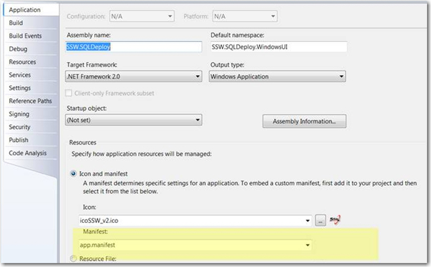

Some applications may need to have administrator right for running the application, e.g. create a file, access system library, etc. It will be an issue for the application to run if UAC is turned on. Below is the step to solve the issue:

<!--endintro-->

1. Add App.Manifest into WindowsUI project. It should contain the below code: 

```xml
<?xml version="1.0" encoding="utf-8"?>
<asmv1:assembly manifestVersion="1.0" xmlns="urn:schemas-microsoft-com:asm.v1" xmlns:asmv1="urn:schemas-microsoft-com:asm.v1" 
  xmlns:asmv2="urn:schemas-microsoft-com:asm.v2" xmlns:xsi="http://www.w3.org/2001/XMLSchema-instance">
  <assemblyIdentity version="1.0.0.0" name="MyApplication.app"/>
  <trustInfo xmlns="urn:schemas-microsoft-com:asm.v2">
    <security>
      <requestedPrivileges xmlns="urn:schemas-microsoft-com:asm.v3">
        <requestedExecutionLevel level="requireAdministrator" uiAccess="false" />
      </requestedPrivileges>
    </security>
  </trustInfo>
</asmv1:assembly>
```

**App.Manifest**

2. Change the project settings for WindowsUI to use the newly created App.Manifest.


