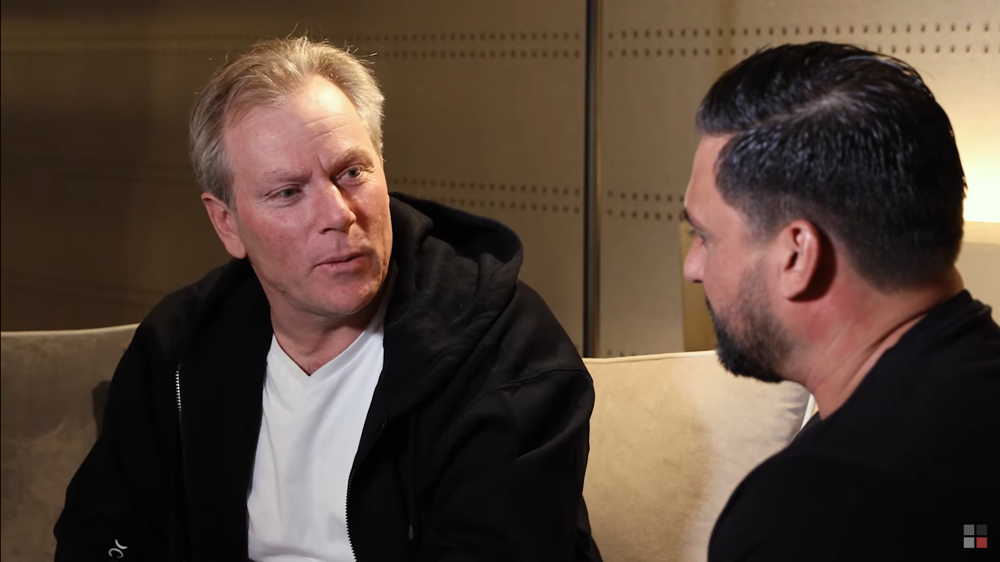
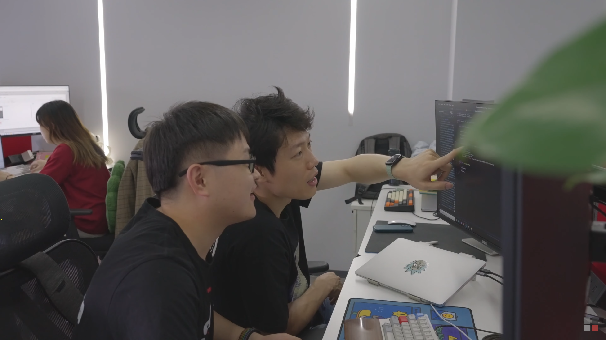
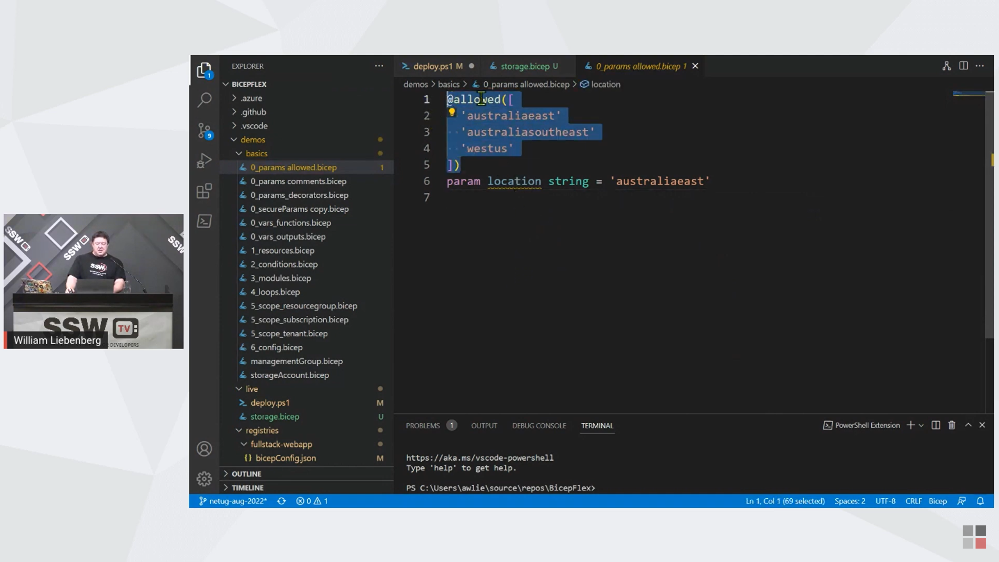

Understanding basic video terminology allows for better communication in video creation. Using basic video terminology can make our video content more engaging. It's important and useful for anyone involved in video production to know the basic terminology.

## Filming Terminology

### Primary footage (main video)

Primary footage is the footage that "tells" the story. It's the main audio and video that often consists of one or more people discussing a topic or relating a narrative. Primary footage is the predominant format for most documentaries, newscasts, talk shows, or reality show videos.

For example, on the SSW TV YouTube channel, this video mainly consists of the primary footage.

Primary footage can be greatly enhanced by using additional footage known as B-roll.

### B-roll footage

B-roll is used to visually support the primary video in telling the story. For example, if the primary footage talks about the Office, the B-roll might be the employees, the team meeting etc.

For example, when the main video/primary footage comes to “our developers are working really hard”, the overlay footage is the developer at work.

## Editing Terminology

### Overlay

Overlay are clips that visually show what the main video is talking about. This allows to highlight the content being told.

For example, when you talk about a delicious meal and cutting to the delicious meal.

### Sequence

Sequence is a series of clips that are usually used in a time-ordered or sequential manner, such as tutorial videos and conference videos.

### Montage

If the sequence clip has a strong chronological order, montage breaks this order by combining footage taken at different times to express a new idea.

Montage is a clip that combines different shots to create new meaning, helping to reveal the connections between things and show the nature of what's happening over time.

It is widely used in video production, such as the use of montage clips at the intro, both to highlight the content of the video, but also to make the video more attractive.

`youtube: https://www.youtube.com/embed/Em_kgd3R_gw`

**Figure: The intro of the NDC video uses montage**

`youtube: https://www.youtube.com/embed/BIapqdy170k?t=137`

**Figure: Food and clip people chatting happily - they enjoy the food and have a good time - See 2:17**