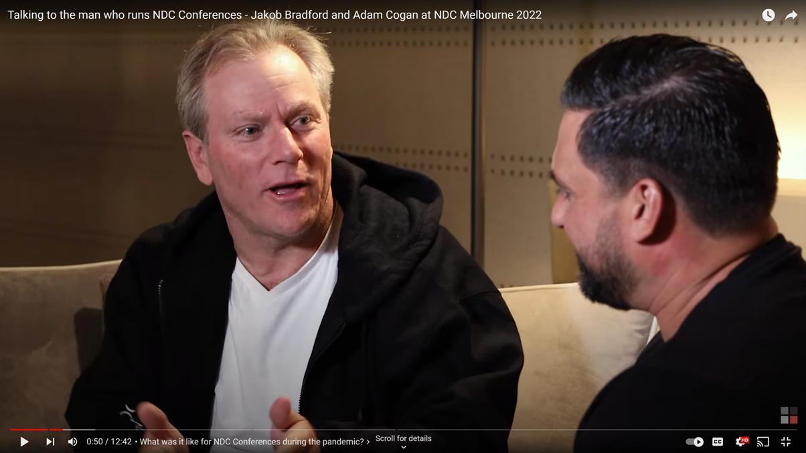
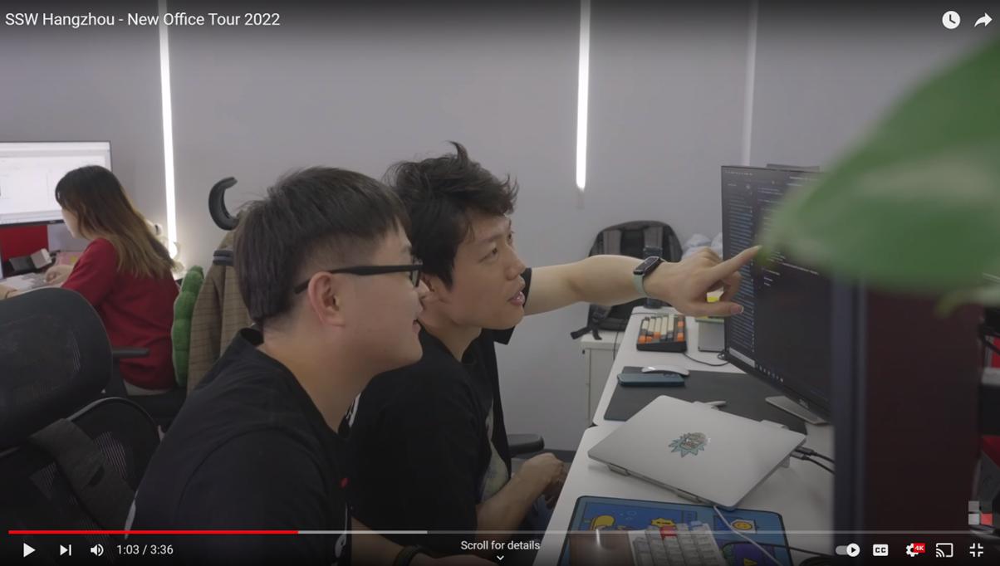
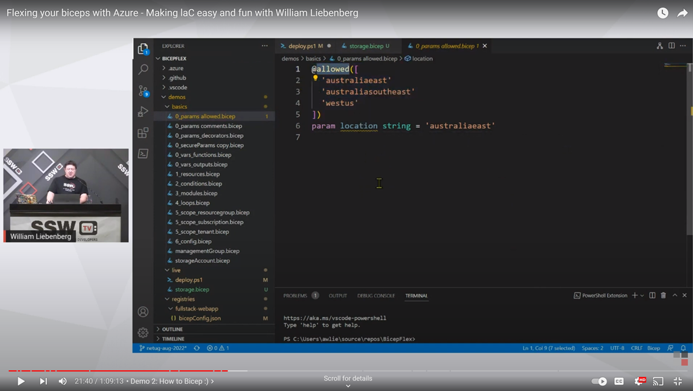
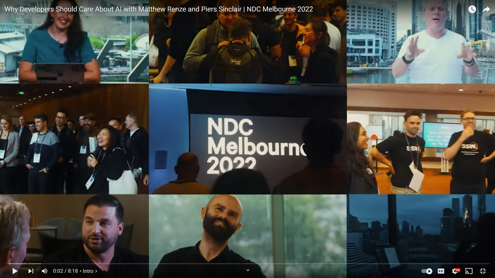

Understanding basic video terminology allows for better communication in video creation. Using basic video terminology can make our video content more engaging. It's important and useful for anyone involved in video production to know the basic terminology.

## Footage Terminology

### A-Roll

A-Roll is the footage that "tells" the story. It's the main audio and video that often consists of one or more people discussing a topic or relating a narrative. A-Roll is the predominant format for most documentaries, newscasts, talk shows, or reality show videos.

For example, on the SSW TV YouTube channel, this video mainly consists of the A-Roll footage.

A-Roll alone would be boring because it's just people talking, body movements, pausing to think, etc. The B-Roll footage is really what makes a story come alive.

### B-Roll

B-roll is supplemental footage for A-Roll that provides supporting details and greater flexibility when editing video. For example, if the A-Roll talks about the Office, the B-Roll might be the employees, the team meeting etc.

For example, when the main video/A-Roll comes to “our developers are working really hard”, the B-Roll is the developer at work.

## Editing Terminology

### Cutaway

Cutaway is a clip that emphasizes content, usually consisting of the audio of A-Roll and the footage of B-Roll, to ensure the coherence of the story and highlight the content told.

For example, when you talk about a delicious meal and cutting to the delicious meal.

### Sequence

Sequence is a clip that is usually used in time-ordered or sequential videos, such as tutorial videos and conference videos. If the time sequence is disrupted, the content of the video cannot be fully presented.

### Montage

If the sequence clip has a strong chronological order, montage breaks this order by combining footage taken at different times to express new content.

Montage is a clip that combines different shots to create new meaning, helping to reveal the connections between things and show the nature of what's happening over time.

It is widely used in video production, such as the use of montage clips at the intro, both to highlight the content of the video, but also to make the video more attractive.

