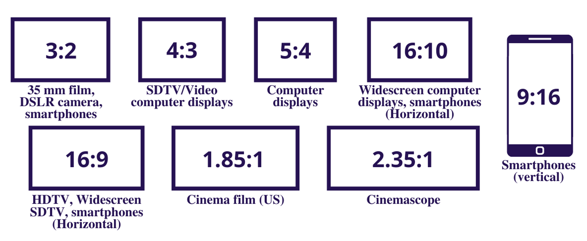

Understanding basic video terminology allows for better communication during the production workflow. It's important for anyone involved in video production to know the basic terminology to keep feedback clear and concise.

<!--endintro-->

## Filming Terminologies

### 1. Primary Footage

Primary footage is what tells the story by conveying a message. It's the main audio and video that often consists of one or more people discussing a topic or subject. Documentaries, talk shows, or TV shows.

For example, the interview of Adam and Jakob talking is the “primary footage” which drives the story.

`youtube: https://www.youtube.com/embed/mQyzt4CV_Jw`

**Video: Primary Footage - Talking head - [0:38 - 3:05](https://youtu.be/mQyzt4CV_Jw?t=38)**

Primary footage can be greatly enhanced by using additional footage known as B-Roll.

### 2. B-Roll Footage

B-Roll is any supplemental footage used to visually support the primary footage in telling the story by adding detail and examples. 

The video here uses B-Roll footage - developer at work, to supplement the primary footage audio "our developers are working really hard".

`youtube: https://www.youtube.com/embed/BioFgITYAFY`

**Video: B-Roll - Developer at work - [1:01 - 1:04](https://youtu.be/BioFgITYAFY?t=63)**

B-Roll and overlay are common terminologies for footage that is placed over the top of other footage to help clarify the topic/subject for the viewer.

## Video Editing Terminologies

### 3. Overlay

An overlay is any footage, graphic or visual element that adds detail or information to footage without completely obstructing the primary footage.

For example, when you talk about a meal and cutting to a clip of that delicious meal.

### 4. Cutaway

The cutaway shot is a filmmaking and video editing technique. It is a supplementary shot that “cuts away” from the main action.

For example, when watching a car chase in a film, and during the scene of the racing cars, we "cutaway" to someone having coffee at a roadside cafe, and the cars fly past. Then we resume the cars chase sequence.

### 5. Sequence

A Sequence is a series of clips that are edited in a linear or non-linear order to deliver a story or message.

`youtube: https://www.youtube.com/embed/g4_MnAZJpxg?t=318`

**Video: Sequence - Give context a scene - [5:18 - 5:23](https://youtu.be/g4_MnAZJpxg?t=318)**

### 6. Montage

Montage is video editing together several video clips to form a new idea, meaning or create a summary of events.

For example, a montage can help reveal the connections between things and show the nature of what's happening over time.

`youtube: https://www.youtube.com/embed/BIapqdy170k?t=188`

**Video: Montage - Hiking over memorial walk - [3:07 - 3:47](https://youtu.be/BIapqdy170k?t=188)**

### 7. Intro

An Intro can include a title sequence, logo or a hook (Short and catchy footage).  Often a opening theme song with visuals are used. 

`youtube: https://www.youtube.com/embed/x2b-gw2W8b4`

**Video: Intro - NDC intro - [0:00 - 0:19](https://youtu.be/x2b-gw2W8b4)**

### 8. Outro

An Outro are the closing visuals that appear at the end of a video. It can include a call to action message, contact details or social media links.

`youtube: https://www.youtube.com/embed/k7bQ320vOj0?t=202`

**Video: Outro - [3:22 - 3:44](https://youtu.be/k7bQ320vOj0?t=202)**

### 9. Lower Third

A lower third is a combination of text and graphical elements placed in the lower area of the screen to give the audience more information about what's on screen or a presenter's name and title.

For example, the lower third here point out the key words of the video.

`youtube: https://www.youtube.com/embed/https://youtu.be/2Ff6NQrWMsY?t=1`

**Video: Lower third - Show the key words - [0:01 - 0:10](https://youtu.be/2Ff6NQrWMsY?t=1)**

### 10. PIP (Picture-In-Picture)

PIP footage is commonly overlayed one video onto another, displaying both videos simultaneously.

For example, the interview here is use PIP effect.

`youtube: https://www.youtube.com/embed/https://youtu.be/uUI6pllk6TA?t=22`

**Video: PIP - [0:22 - 1:34](https://youtu.be/uUI6pllk6TA?t=22)**

### 11. Video Scrubbing

In editing software, video scrubbing can be done by moving the cursor forwards or backward through the timeline to quick skip forward or backward in the sequence to review footage for feedback purposes.

### 12. Aspect Ratio

Aspect ratio relates how the width and height of your video relate to each other. Those dimensions are expressed through a ratio.

Examples of the Most Common: 4:3, 16:9, 1.85:1

See the image below for more examples of this video editing term.

### 13. White Balance

A proper white balance is characterized by the whites in an image truly being the color white. 

For instance, in an improper white balance, the whites may have tints of yellow, green, red, or some other color. White balance’s formal definition is the process of gathering the accurate colors for the light that is available. Your camera may come with a white balance menu and an auto white balance feature.

### 14. Sync (Synchronization)

A production is synchronized when the audio aligns with the video imaging.

### 15. Frame Rate

The frame rate is the rate that your shutter cycles through opening and closing or when the sensor captures video in a 1 second period.

Common frame rate examples: 24, 25, 29.97, 30, 50, 60. The frame rate is expressed through frames per second (fps).

### 16. Dissolve

It's a transition effect in which one video clip (or picture) fades out gradually as another image replaces it.

### 17. Fade

It's a transition effect in which one video clip (or picture) fades out gradually as it blends into (or appear out of) a colour clip.

### 18. Rendering

It is the method of combining all the clips (including modifications and additional features) to create a refined video clip.

### 19. Picture Lock (Test Passed)

The video has been approved and the feedback loop is closed. It is the stage of the editing process in which there are no more alterations to the length and order of the shots. The editing crew may continue to work on the sound and visual effects at their own discretion as long as it does not drastically change the overall message, tempo, beats, and story of the picture-locked video.