Understanding basic video editing terminology allows for better communication during the post-production workflow. It's important for anyone involved to know the basic terms to keep feedback clear and concise.

<!--endintro-->

## Video Editing Terminology

### 1. Primary Footage (aka Main Footage)

Primary footage is what tells the story by conveying a message. These are general types of primary footage: 

1. Talking heads in an interview
2. Screen share during a live demo
3. Combination of talking heads in a split screen

For example, the interview of Adam and Jakob talking is the “primary footage” which drives the story.

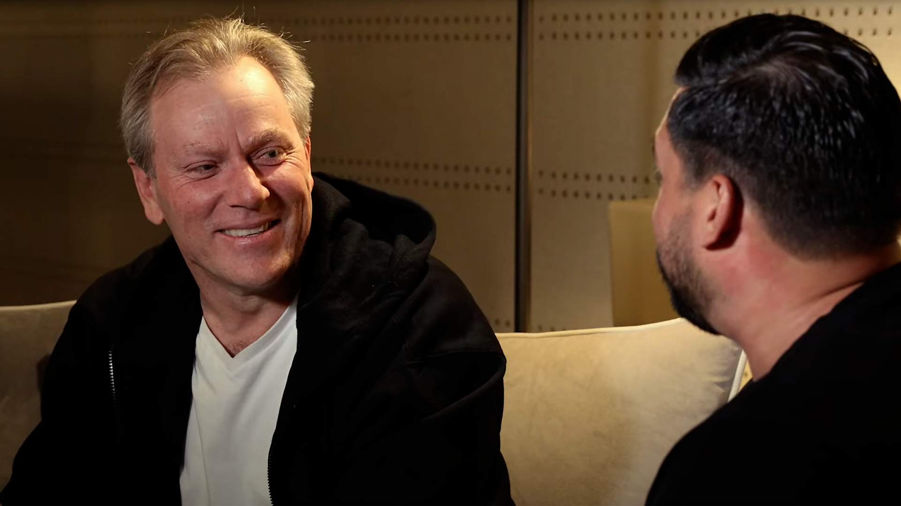

**Video: Primary Footage - Talking head - [0:38 - 3:05](https://youtu.be/mQyzt4CV_Jw?t=38)**

Feedback example: "At 2:22, can we stay on primary footage of Adam until he finishes his comment?"

### 2. Overlay

An overlay is a general term for any footage, graphic or visual element placed on screen that adds detail or information to the main footage. The common types of overlays used by SSWTV are B-roll, lower third, and PIP. You will learn more about them in this Rule.

For example, when talking about what's needed to start a coding project in Visual Studio and displaying a checklist confirming all the components.

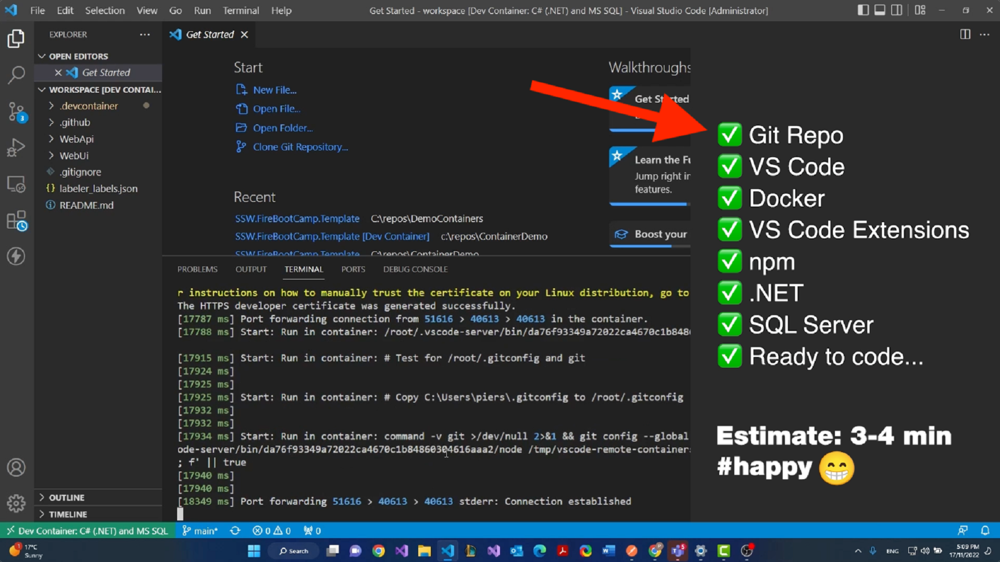

**Video: Overlay - [2:10 - 2:15](https://youtu.be/Yhp37fPn6dQ?t=130)**

Feedback example: "At 2:22, add in some overlay to show what they are talking about in the primary footage."

### 3. Lower Third

A lower third gives the audience information about a presenter's name and title or what's displayed on screen, and can be a combination of text and graphical elements. 

For example, the lower third here is the presenter's name and job title.

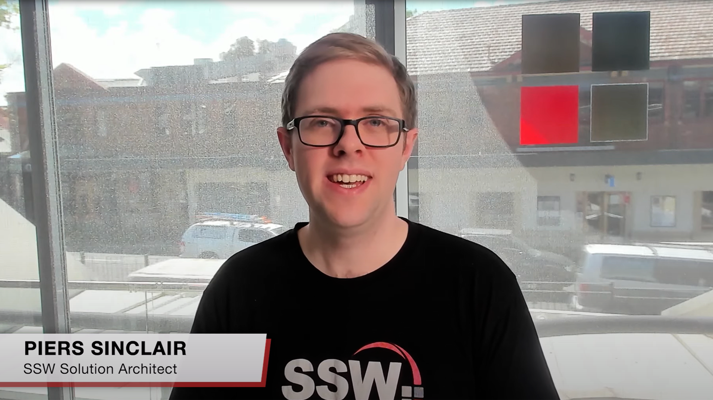

**Video: Lower third - [0:15 - 0:21](https://youtu.be/2Ff6NQrWMsY?t=15)**

Feedback example: "At 2:22, the presenter's name is misspelled in the lower third."

### 4. B-Roll Footage

B-Roll is any supplemental footage used to visually support the primary footage in telling the story by adding detail and examples. B-Roll is placed over the top of primary footage to help clarify the topic/subject for the viewer. Primary footage can be greatly enhanced by using B-Roll.

The video here uses B-Roll footage - developers at work, to supplement the primary footage audio "our developers are working really hard".

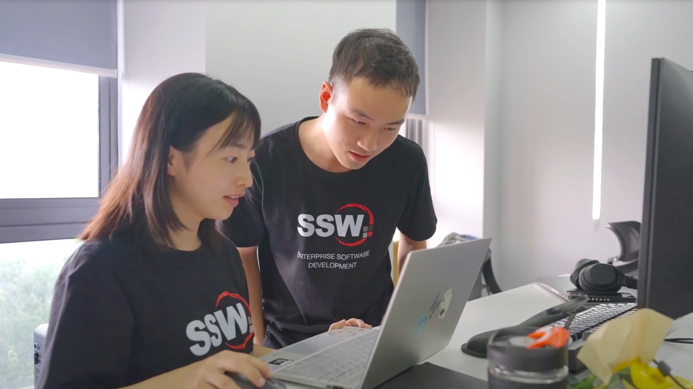

**Video: B-Roll - Developers at work - [1:01 - 1:04](https://youtu.be/BioFgITYAFY?t=61)**

Feedback example: "At 2:22, the B-Roll - looks out of focus, can we swap out for something else?"

### 5. Cutaway

The cutaway shot is a filmmaking and video editing technique. It is a supplementary shot that “cuts away” from the main action.

The SSWTV channel does not use cutaways in its content.

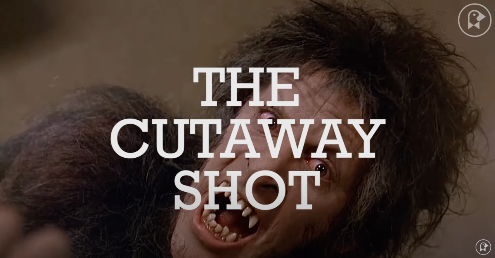

**Video: Cutaway - Different types - [0:06-1:39](https://youtu.be/WrIwfImLXOA?t=6)**

For example, a cutaway can manipulate tension, convey humor or cast doubt or ambiguity on a scene, among other things. In a way, the director can speak directly to the audience.

### 6. Sequence

A sequence is a series of clips that are edited in a linear or non-linear order to deliver a story or message.

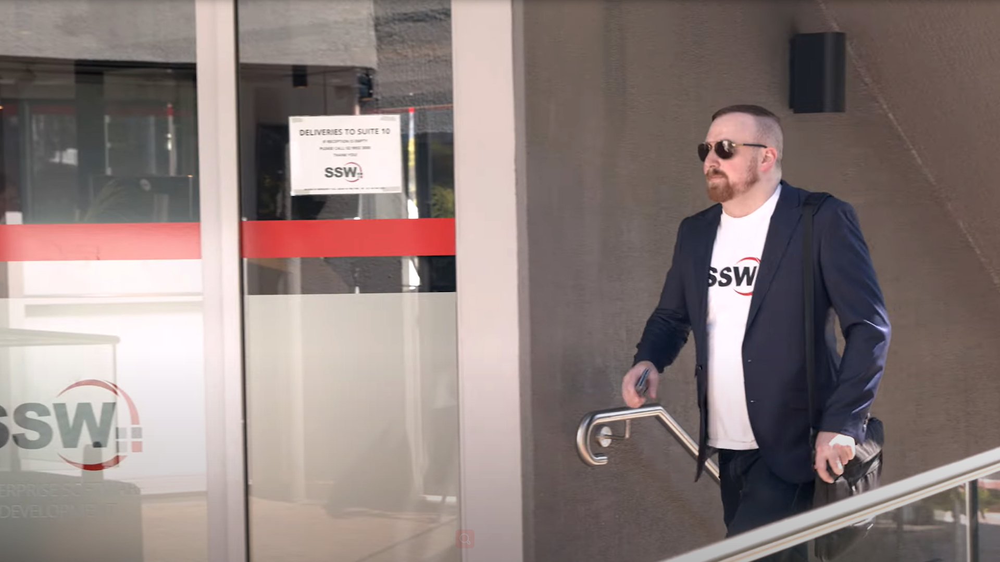

**Video: Sequence - Give context a scene - [5:18 - 5:23](https://youtu.be/g4_MnAZJpxg?t=318)**

Feedback example: "At 2:22, we need to add B-roll to the sequence of him walking up to the SSW office."

### 7. Montage

A montage is video editing together several video clips to form a new idea, meaning or create a summary of events.

For example, a montage can help reveal the connections between things and show the nature of what's happening over time.

**Video: Montage - Hiking over memorial walk - [3:07 - 3:47](https://youtu.be/BIapqdy170k?t=188)**

Feedback example: "At 2:22, change add a shot in the montage of the SSW team waving at the camera."

### 8. Intro

An intro can include a title sequence, logo or a hook (short and catchy footage).  Often a opening theme song with visuals are used. 

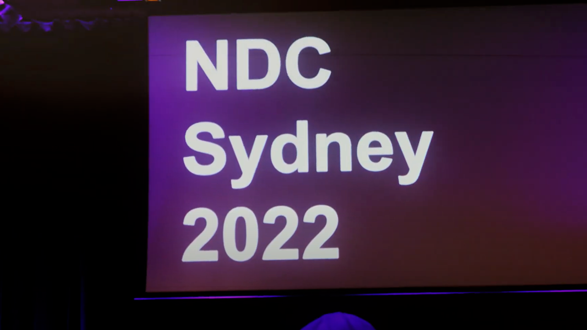

**Video: Intro - NDC intro - [0:00 - 0:19](https://youtu.be/x2b-gw2W8b4)**

Feedback example: "At 2:22, let's remove the intro and just get into the primary footage."

### 9. Outro

An outro are the closing visuals that appear at the end of a video. It can include a call to action message, contact details or social media links.

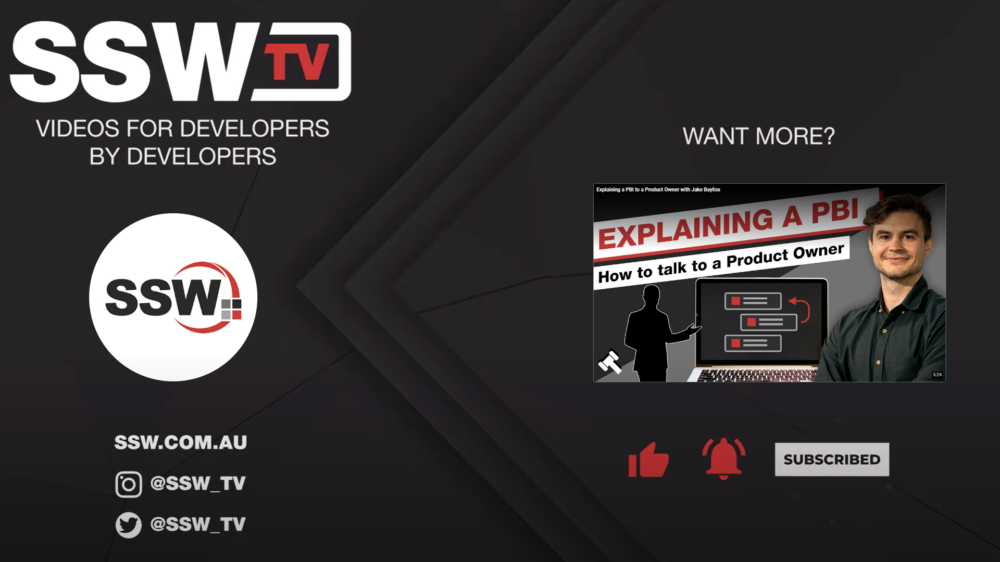

**Video: Outro - [3:22 - 3:44](https://youtu.be/k7bQ320vOj0?t=202)**

Feedback example: "At 2:22, in the outro, have a link to our latest video on our YouTube channel."

### 10. PIP (Picture-In-Picture)

PIP is when one video source is placed over the primary footage, and is generally small and to one lower corner of the screen, displaying both videos simultaneously.

For example, the screen share in this presentation uses a PIP effect of the presenter's video over the demostration recording.

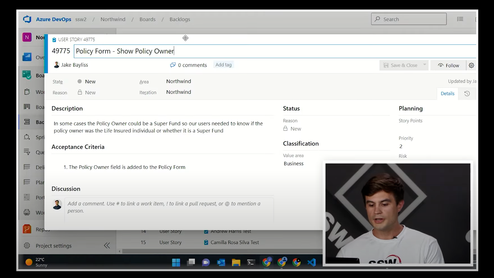

**Video: PIP - [3:32 - 4:21](https://youtu.be/L94TEsTuLz4?t=212)**

Feedback example: "At 2:22, show the PIP so we can see Jason talking."

### 11. Split Screen

Is a video editing technique in which the frame is divided into discrete non-overlapping images or video sources.

For example, Piers and Sam are shown in a split screen during the interview.

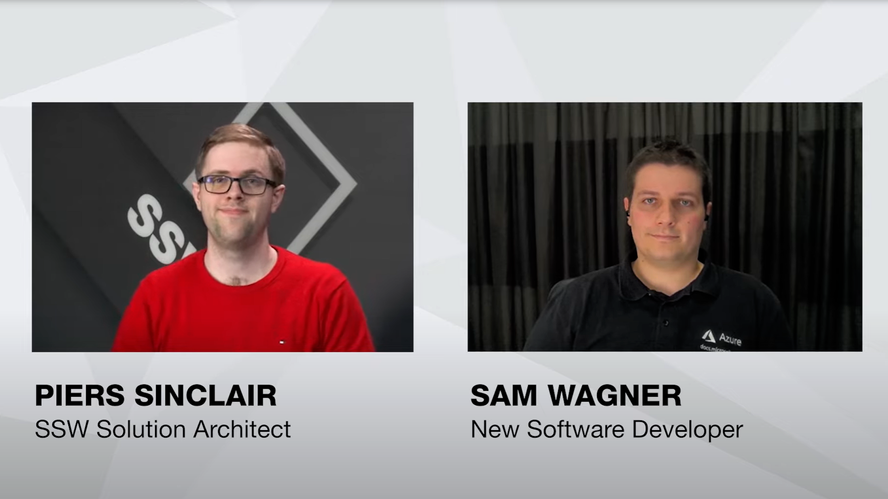

**Video: Split Screen - [0:22 - 1:34](https://youtu.be/uUI6pllk6TA?t=22)**

Feedback example: "At 2:22, it would be better if see both presenters. Can we use a split screen here?"

### 12. Video Scrubbing

In editing software, video scrubbing can be done by moving the cursor forwards or backward through the timeline to quick skip forward or backward in the sequence to review footage quickly for feedback purposes.

For example, just like skipping forward or back in YouTube by using the arrow keys, in Premiere Pro you can do the same by moving the playhead.

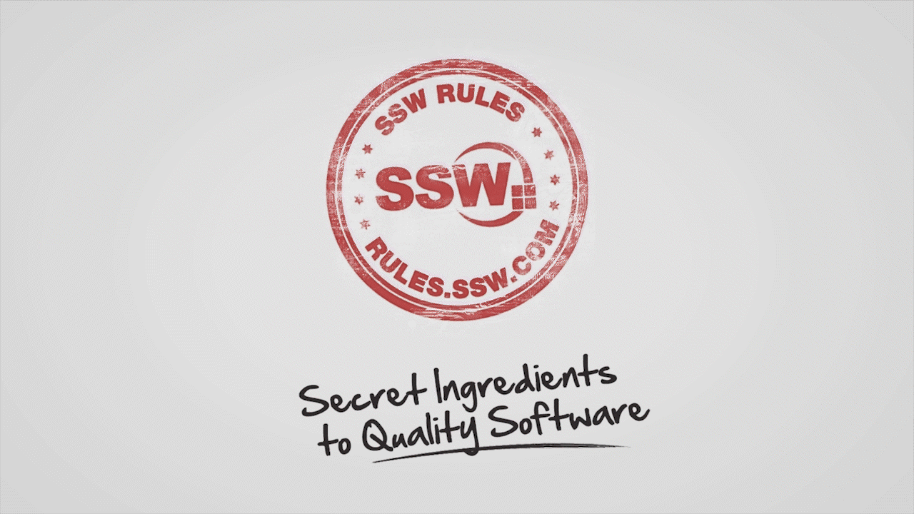

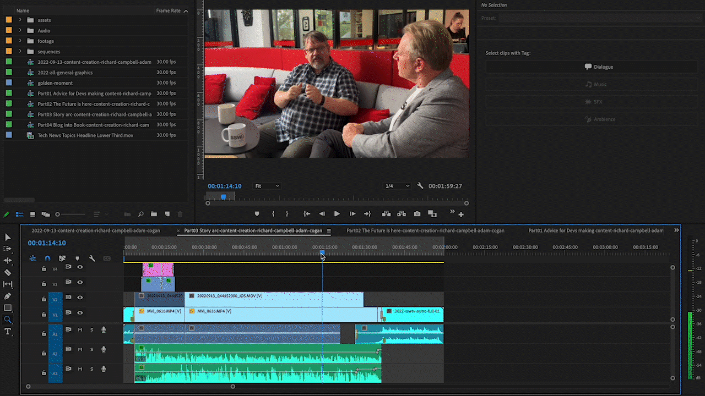

Feedback example: "Hey Sam starting at 2:22, please scrub through the primary footage and see which take is my best to use. Thanks!"

### 13. Aspect Ratio

Aspect ratio relates how the width and height of your video relate to each other. Those dimensions are expressed through a ratio.

Examples of the most common: 4:3, 16:9, 1.85:1

For example, on SSWTV channel, we often use 16:9 for online media platforms and 9:16 on TikTok and YouTube shorts.

See the image below for more aspect ratios.

Feedback example: "This video export is the wrong size, it's not SSWTV standards. Can we check the aspect ratio?"

### 14. Colour - White Balance

A proper white balance is characterized by the whites in an image truly being the color white. 

For instance, in an improper white balance, the whites may have tints of yellow, green, red, or some other color. White balance’s formal definition is the process of gathering the accurate colors for the light that is available. Your camera may come with a white balance menu and an auto white balance feature.

Feedback example: "At 2:22, Jason's shirt seems a little too yellow, can we check the white balance?"

### 15. Audio - Sync

When the audio is recorded separately than the camera, you will need to sync to he recording to the camera audio during the edit.

Feedback example: "At 2:22, Adam's mouth moving at a different time than the recording audio, it has a audio sync error."

### 16. Audio - Denoise

Audio denoising is the process of reducing unwanted audio anomolies like background ambience, wind, or static from dialogue without affecting the quality.

Feedback example: "At 2:22, I can hear a buzzing sound with my headphones on, but not when watching on my iPad. Can we denoise the audio?"

### 17. Audio - Levels

When video editing, it's important to have standard audio levelling. 

For example, if the presenter's voice is too quiet, it can be improved by increasing the gain of the audio clip. Vice versa if the dialogue/music is too loud, the audio levels would need to be lowered to reduce peaking.

Feedback example: "At 2:22, Adam's audio sounds soft because he turns his head away from the microphone, please increase the levels"

### 18. Audio - Clarity

Audio that is clear and audible without any unintentional distortion.

### 19. Cut - Jump Cut

Is a single continuous shot of a subject and is broken into parts, with a piece of footage being removed in order to render the effect of jumping forward in time. Jump cuts are a quick and dirty way to remove silence in an interview or presentation and "Ums" in the dialogue. SSWTV rarely uses jump cuts; however, other YouTube channels use them exclusively.

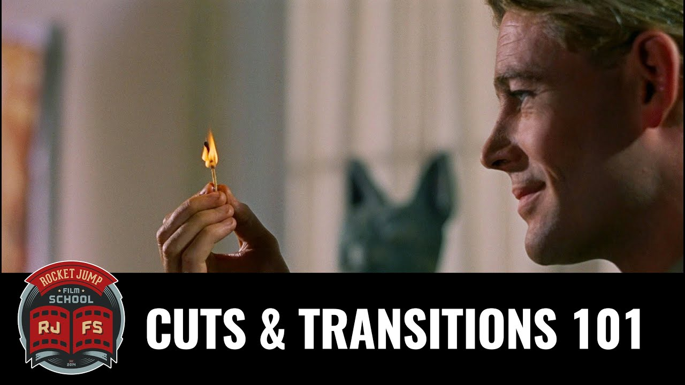

**Video: Jump Cut - [2:13 - 2:59](https://youtu.be/OAH0MoAv2CI?t=133)**

Feedback example: "At 2:22, the jump cut here is too noticeable. Can we try a different angle?"

### 20. Cut - Punch In

This is when the same video clip is used from one cut to another, but the scale is increased from one zoom level to the next.

For example, you can punch in from a wide shot to a medium shot using the same clip to get a closer angle. 

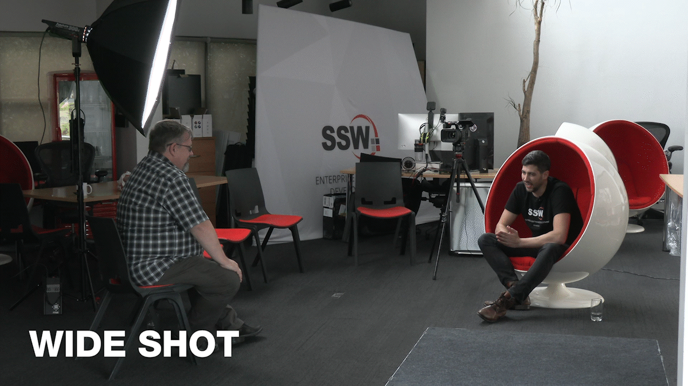

**Video: Punch In - [1:34 - 1:54](https://youtu.be/oN30JcV16ak?t=94)**

Feedback example: "At 2:22, he is talking about something really important, can we punch in?"

Note: This is easily achieved when using 2k or 4k resolution footage.

### 21. Transition - Cross Dissolve

Is a transition effect in which one video clip (or picture) gradually fades out and is replaced by another image or video clip.

For example, when transitioning from a full screen share to the presenter on stage, using a cross dissolve makes the edit smoother.

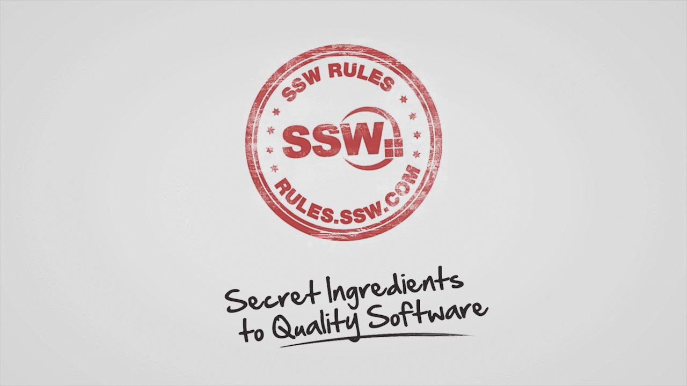

Feedback example: "At 2:22, add in a cross dissolve from the intro to the presenter."

### 22. Transition - Fade

Is a transition effect in which one video clip (or picture) fades out gradually as it blends into (or appear out of) a colour clip.

For example, "Fade to Black" is commonly used to visually signal the end of a scene or when changing from one subject to another.

Feedback example: "At 2:22, fade to black at the end of the demo."

### 23. Video Rendering

Is the operation by which the computer processes the edited sequence to allow for a full resolution preview to be watched. This includes all visual effects without the need of buffering and results in a smoother viewing experience during playback.

Video rendering is similar to compiling code for developers.

### 24. Video Export

When a video edit is complete, it's time to export a video file from your video editing software. The exported file is usually uploaded to an online platform e.g. Youtube. 

Note: It is important to check the export settings to ensure that they are set to High Quality 1080p as a standard.

### 25. Test Passed (aka Picture Locked)

The video has been approved and the feedback loop is closed. It is the stage of the editing process in which there are no more alterations to the length and order of the shots. The editing crew may continue to work on the sound and visual effects at their own discretion as long as it does not drastically change the overall message, tempo, beats, and story of the picture-locked video.

Feedback example: "Great work! Test passed, I can't wait to share it once it's live."