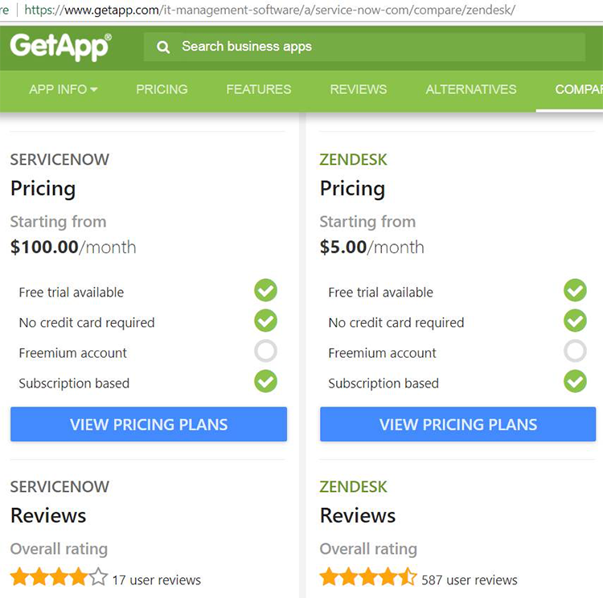

 
   <b>Zendesk</b> and 
   <b>Service Now</b> are the leading ticketing engines.

Zendesk has a larger market share, lower cost and better 'overall rating' as per 
   <a href="https://www.getapp.com/it-management-software/a/service-now-com/compare/zendesk/" target="_blank">getapp.com</a>.​​​ 

 <excerpt class='endintro'></excerpt> 
<dl class="image"><dt>
      
   </dt><dd>Figure: Zendesk vs Service Now </dd></dl>

