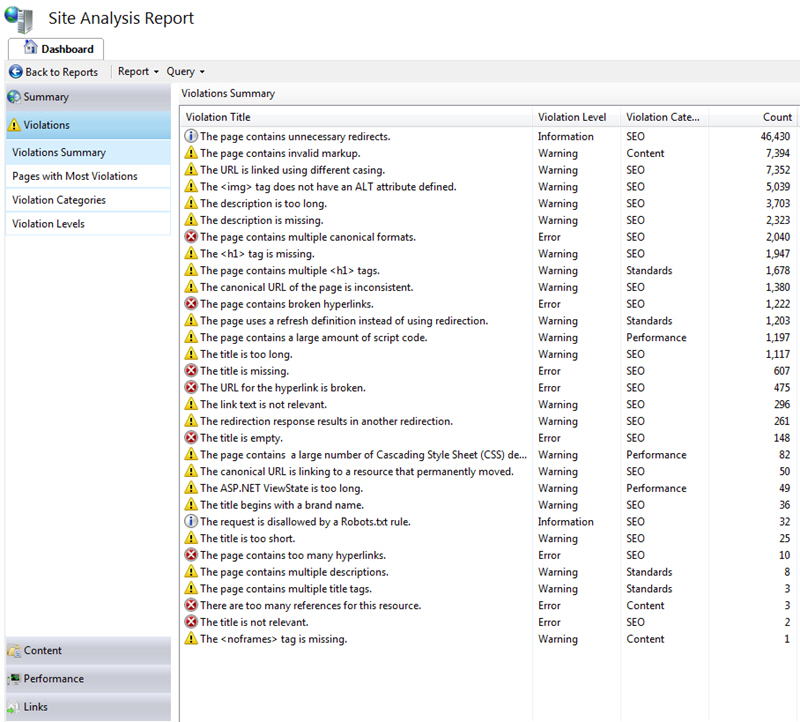

​There are a number of things you can do to make your content more search-friendly in IIS. 
<ul><li>Make content search engine-friendly</li><li>Improve volume and quality of traffic</li><li>Control how search engines will access and display content</li><li>Inform search engines about locations that are available for indexing</li><li>Show broken pages</li></ul>
 <excerpt class='endintro'></excerpt> 

​​You can use the <a href="http://www.iis.net/extensions/SEOToolkit">IIS SEO</a> Toolkit to find most of your problems.
<dl class="image"><dt>​​</dt><dd>Figure: Analyzing your site is easy</dd></dl><dl class="image"><dt>​​​Figure: You never know how many problems you have until you try​</dt></dl>
See <a href="http://weblogs.asp.net/scottgu/archive/2009/06/03/iis-search-engine-optimization-toolkit.aspx">ScottGu's post on IIS Search Engine Optimization Toolkit</a> for more information​​​ 

