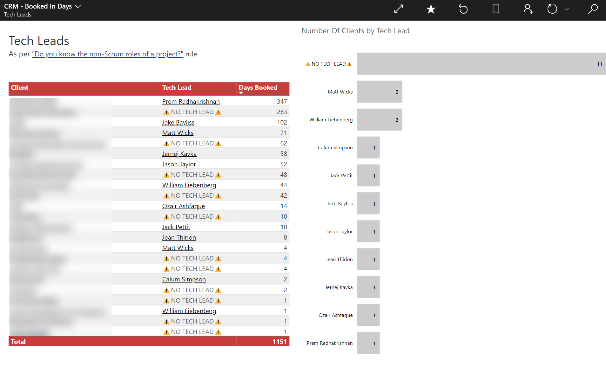

Scrum already covers the roles of the **[Developers](https://www.youtube.com/watch?v=vLqCkj0PvtE)**, the **[Product Owner](/do-you-know-the-how-to-be-a-good-product-owner)**, and the **[Scrum Master](/the-team-do-you-help-your-scrum-master-not-scrummaster-protect-and-serve-the-team)**, but from a consultancy’s side, there’s also the **Tech Lead** and the **Account Manager** to consider.

Confusion often arises when these roles overlap, especially when sales or account managers step into delivery activities or when tech leads discuss matters outside their scope.

This rule clarifies responsibilities and ensures smooth collaboration.  

<!--endintro-->

## Account Manager

An Account Manager’s main job is to **own the relationship with the client** and ensure satisfaction, without stepping into daily project delivery. They should support the Tech Lead and Scrum Master, not replace them.

As a guiding principle, Account Managers should not join daily scrums or participate in technical conversations — those are best left to the delivery team. However, relationships are fluid, and occasionally joining a stand-up (e.g., to check in with the client or resolve a relationship issue) may be appropriate. The key is to respect boundaries: don’t manage the project or the technical side of things.

### ❌ Generally avoid

- Joining daily scrums (unless there is a specific relationship issue to address)  
- Changing resources mid-week (resourcing changes should be deliberate and always involve the Tech Lead)  
- Having technical conversations with the client on the side, without the Tech Lead present

### ✅ Focus on 
*  Communication from [initial contact](/do-you-manage-your-inbound-leads-effectively), to [Initial Meeting](/meetings-do-you-know-the-agenda-for-the-initial-meeting), through to the [Spec Review](/rules-to-better-specification-reviews) until the main body of work is booked
*  Managing key relationships, Ensuring the client is happy with the Tech Lead and Scrum Master 
*  Getting [T&Cs](https://www.ssw.com.au/ssw/Standards/Forms/ConsultingOrderTermsConditions.aspx) and any other required docs signed
*  CRM data entry and maintenance of Company, Contact, Opportunities, and [tracked emails](/track-important-emails)
*  Invoicing
*  Conflict resolution
*  Ongoing resourcing of the project and [booking of Developers](/scheduling-do-you-know-how-to-book-developers-for-a-project)
*  Budget discussions
*  Join Sprint Reviews periodically e.g. once a month (or if there are issues)

## Tech Lead

**Generally avoid:**
- ❌ Discussing money or budget directly with the client  

**Focus on:**
* ✅ Displays ownership of the project, and keeps the code quality high, and technical debt low
* ✅ Responsible for the delivery of the project into production
* ✅ Spec Review - Primary communicator with the Product Owner
* ✅ Project - Primary communicator with the Product Owner
* ✅ DevOps - Ensures good practices are followed e.g. release to production as frequenty as possible
* ✅ Responsible for the architecture and technical direction of the project
* ✅ Helps the Account Manager with technical areas of conflict management
* ✅ Keeps on top of the budget and timelines

::: good

:::

::: email-template

| | |
| -------- | --- |
| To: | {{ TECH LEAD }} |
| Subject: | Tech Lead - {{ CLIENT NAME }} |
::: email-content

### Hi {{ TECH LEAD }}

According to {{ LINK TO CLIENT CRM RECORD }}

As you can see, you are the Tech Lead for {{ CLIENT NAME }}.

1. Did you already know this?
2. Have a read of [SSW.Rules | Do you know the non-Scrum roles of a project?](/know-the-non-scrum-roles) Make sure you know what is involved with this non-Scrum role (it’s not just responsibility of the technical decisions on the project 😉)
3. Of those bullet points listed on the rule… which is your #1?

:::
:::
::: good
Figure: Good Example - copy this as email template and send to the Tech Lead so they know what is involved
:::
