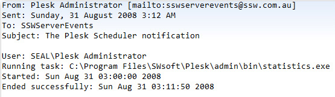
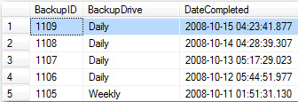
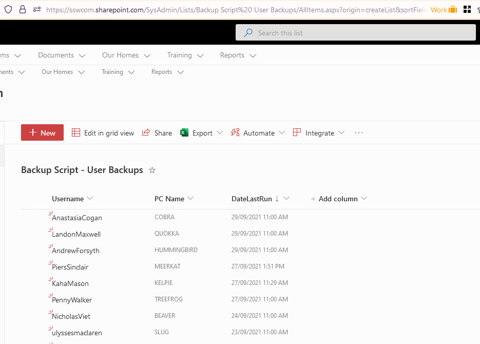
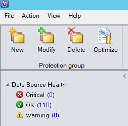

For any kind of backups, it is important to log a record on success so you can check for backups that have failed.

<!--endintro-->

Without some kind of logging e.g. on a SQL database, on a txt file, on a SharePoint list, it is impossible to tell which backups have been completed or not. This applies to backups of any kind e.g. servers, personal computers, emails.

Some important stats to log:

1. Date - Date backup has run
2. Username - If a personal backup, which user was logged in when the backup ran
3. PC Name - The name of the server (or PC) the backup came from

Having entries logged in a database is better than having an email sent because entries are easier to see and manage, and emails might get lost in the noise.

::: bad

:::

::: good

:::

::: good

:::
Now you are able to be aware of missing backups. You can make automatically notifications based on the above table e.g. [by SQL Reporting Services data-driven subscription](https://www.ssw.com.au/ssw/KB/KB.aspx?KBID=Q1455840)

It is also important to review the state of your backups at least on a weekly basis, ensuring that backups are not failing and that you are able to restore them when necessary. This is part of a good disaster recovery process.

To see the best backup tools currently available, check [https://www.ssw.com.au/rules/pc-do-you-use-the-best-backup-solution](/pc-do-you-use-the-best-backup-solution)

If you need any help with your backups or disaster recovery process, check <https://www.ssw.com.au/ssw/Consulting/Backup-Recovery.aspx>

::: good

:::
