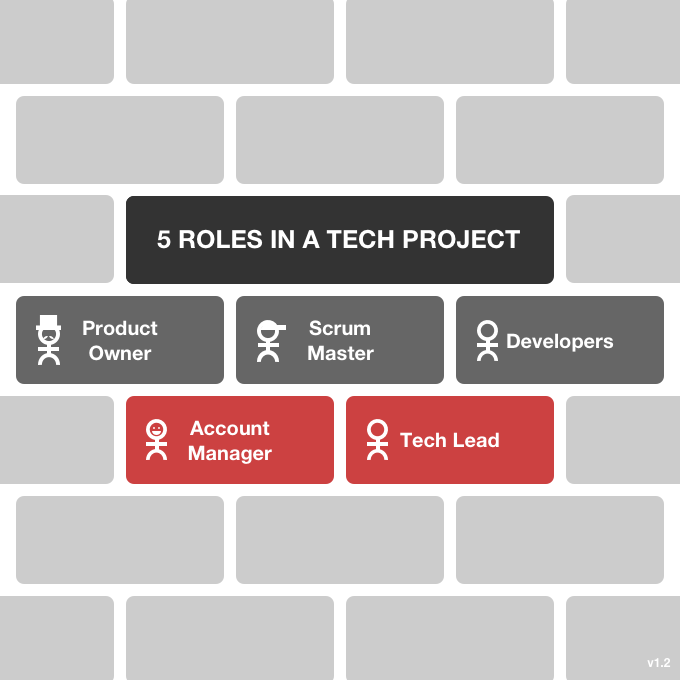
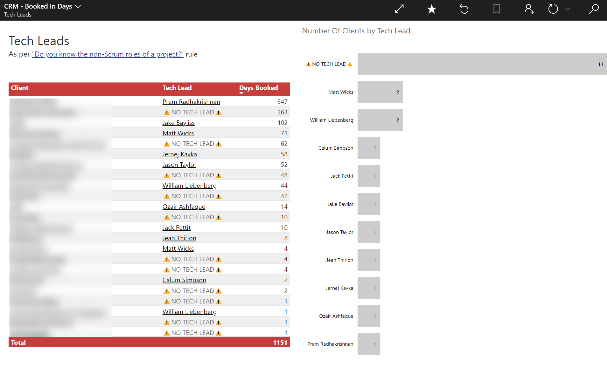

Medium to large software development projects have people on them with varying roles and responsibilities. In order not to double up, or miss something, it’s important to define what each should do.

Scrum already covers the roles of the **[Developers](https://www.youtube.com/watch?v=vLqCkj0PvtE)**, the **[Product Owner](/do-you-know-the-how-to-be-a-good-product-owner)**, and the **[Scrum Master](/the-team-do-you-help-your-scrum-master-not-scrummaster-protect-and-serve-the-team)**, but from a consultancy’s side, there’s also the **Tech Lead** and the **Account Manager** to consider.

<!--endintro-->

### Account Manager

* Communication from [initial contact](/do-you-manage-your-inbound-leads-effectively), to [Initial Meeting](/meetings-do-you-know-the-agenda-for-the-initial-meeting), through to the [Spec Review](/rules-to-better-specification-reviews) until the main body of work is booked
* Managing key relationships
* Getting [T&Cs](https://www.ssw.com.au/ssw/Standards/Forms/ConsultingOrderTermsConditions.aspx) and any other required docs signed
* CRM data entry and maintenance of Company, Contact, Opportunities, and [tracked emails](/track-important-emails)
* Invoicing
* Conflict resolution
* Ongoing resourcing of the project and [booking of Developers](/scheduling-do-you-know-how-to-book-developers-for-a-project)
* Budget discussions

### Tech Lead

* Displays ownership of the project, and keeps the code quality high, and technical debt low
* Responsible for the delivery of the project into production
* Spec Review - Primary communicator with the Product Owner
* Project - Primary communicator with the Product Owner
* DevOps - Ensures good practices are followed e.g. release to production as frequenty as possible
* Responsible for the architecture and technical direction of the project
* Helps the Account Manager with technical areas of conflict management
* Keeps on top of the budget and timelines

::: good

:::

::: email-template
|          |     |
| -------- | --- |
| To:      | {{Tech Lead}} |
| Subject: | Tech Lead - {{Client Name}} |
::: email-content  

### Hi {{Tech Lead}}

According to {{ link to Client record in CRM }}

As you can see, you are the Tech Lead for {{Client Name}}.

1. Did you already know this?
2. Have a read of [SSW.Rules | Do you know the non-Scrum roles of a project?](/know-the-non-scrum-roles) Make sure you know what is involved with this non-Scrum role (it’s not just responsibility of the technical decisions on the project 😉)
3. Of those bullet points listed on the rule… which is your #1?

:::
:::
::: good
Figure: Good Example - copy this as email template and send to the Tech Lead so they know what is involved
:::
