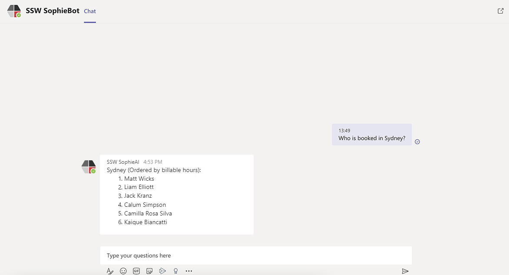
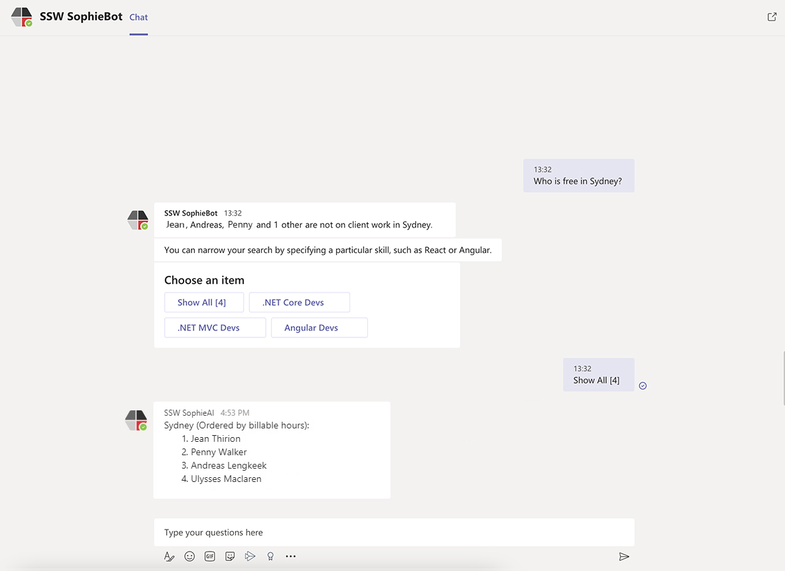
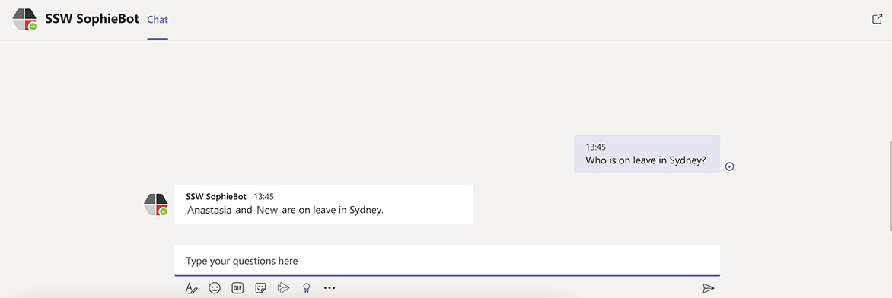

​​​​​It's been said that in order to succeed you have to show up – nowhere is that more true than the workplace. Knowing where your staff are is paramount. 

 <excerpt class='endintro'></excerpt> 

​At the beginning of each day you should: 
<ol><li>Review a staffing report – consider a report in Power BI or a similar tool that shows which of your staff are booked for what activities on any given day 
      <dl class="image"><dt>
            
         </dt><dd>Figure: Green is booked, Black is booked for internal work, and Red is leave </dd></dl></li><li>Make updates to staff bookings as required in the source calendars so that the booked in days report is an accurate representation of what clients staff are assigned to. Ensure that any other staffing or service calendars are also updated to accurately reflect the day's planned activities.
      <dl class="image"><dt>
            
         </dt><dd>Figure: See 4 blue bars. This means they are booked. Not easy eh! </dd></dl></li><li>Review your absence calendar. Each business should have a calendar where employees can note any upcoming absences or leave so that it's easy for other team members to know where folks are at any given time. 
      <dl class="image"><dt>
            
         </dt><dd>Figure: Here are the 2 people on leave​ </dd></dl></li><li>Check who's in the office. Have a look at who's currently in the office and if someone's not present or doesn't have an absence or booking, find out where they are​. You can use a tool like SophieBot or other tools to find out who's physically in your office at any time 
      <dl class="image"><dt>
            
         </dt><dd>Figure: You can use 
            <a href="https://sswsophie.com/sophiebot/">SophieBot​</a> to provide a staffing report of who is physically in the office today </dd></dl><dl class="image"><dt></dt><dd>Figure: SSW SophieBot to answer “Who is booked? [ANSWER: 6 people]</dd></dl><dl class="image"><dt></dt><dd>Figure: SSW SophieBot to answer “Who is free? [ANSWER: 4 people] </dd></dl><dl class="image"><dt></dt><dd>Figure: SSW SophieBot to answer “Who is on leave? [ANSWER: 2 people]​ </dd></dl></li><li>If staff are missing or otherwise unaccounted for, make sure to take appropriate action to find out where they are and why they haven't been in communication </li></ol>

