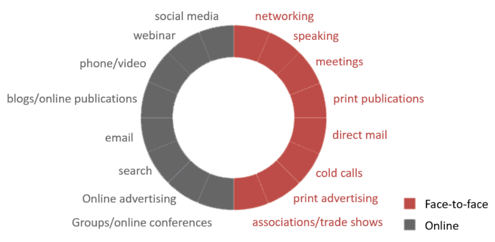

Marketing efforts are the resources you dedicate to promoting your products and services. Through marketing activities, like posting on social media, or paying for advertising, a company can create demand and interest in its items and gain greater visibility with potential customers.​​​​ 

 <excerpt class='endintro'></excerpt> 

​Before deciding on your effort or resources, you need to ask yourself some important questions: ​ 

<ul><li>What are your current marketing efforts? </li><li>What do you need to do with your branding to get new clients?  </li><li>How you have to communicate on social media with all your target audience to achieve your marketing goals?  </li><li>Which social media platforms do you really need to use?  </li></ul>
The ‘effort’ is the daily tasks you will complete to achieve your goals, for example:  
<ul><li>Planning and posting content on social media </li><li>Engaging with your audience </li><li>Booking photo sessions of your products </li><li>Writing blog posts </li><li>Researching bloggers </li><li>Partners and digital influencers to work with your business </li><li>Creating and managing your SEM campaigns </li><li>Organizing events </li></ul>
It's in this phase that you’ll basically decide on what activities you will use to help achieve your goals.
<dl class="image"><dt></dt><dd>Figure: Examples of resources that you can use on your marketing strategy </dd></dl>

