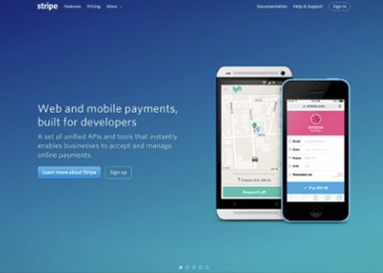

With a clearly defined target audience, it is much easier to determine where and how to market your company. Here are some tips to help you define your target market.

<!--endintro-->

### 1. [Define your Personas](/research-your-buyer-personas), who are your current customers, and why do they buy from you?

- Look for common characteristics and interests.
- Which ones bring in the most business?
- It is very likely that other people like them could also benefit from your product/service.

### 2. Choose who to target: Who needs for your product or service, and who is most likely to buy it, you need to consider:

- Age
- Location
- Gender
- Income level
- Education level
- Marital or family status
- Occupation
- Ethnic background

### 3. Analyze your product/service

- Write out a list of each feature of your product or service.
- Next to each feature, list the benefits it provides
- Once you have your benefits listed, make a list of people who have a need that your benefit fulfils.

### 4. Check out your competition

- Who are your competitors targeting?
- Who are their current customers?
- Don't go after the same market. You may find a niche market that they are overlooking.

### 5. Consider the personal characteristics of the person including:

- Personality
- Attitudes
- Values
- Interests/hobbies
- Lifestyles
- Behaviour Evaluate your decision

### 6. Evaluate your decision

Once you've decided who your target market is, ask yourself:

- Are there enough people who fit my criteria?
- Will my target really benefit from my product/service? Will they see a need for it?
- Do I understand what drives my target to make decisions?
- Can they afford my product/service?
- Can I reach them with my message? Are they easily accessible?

Now you know your audience, you need to stand out to them. You can do this by having a great Value Proposition featured on your website and throughout your campaigns.

Your Value Proposition is hands down one of the most important elements in your marketing message. It tells your potential clients **why they should choose you over any of your competitors** and it makes the benefits of your products or services crystal clear from the get-go.

It can be the key to attracting new business, increasing sales, and making your business a success. The main objective is to target specific groups of consumers to make your campaigns more cost-effective and making the promotion, pricing, and distribution of your products and/or services easier.
The key to this, is not burying your message in buzzwords or meaningless slogans. You need to highlight your message, and make it a focal point on your website, and marketing campaigns.

::: bad  
  
:::

Here is an example of a great Value Proposition advertised by Stripe on their website. Their target audience was developers. Stripe makes it clear that its web and mobile payment products are specifically made for developers and tech-savvy businesses. Its APIs and tools are comprehensive, state-of-the-art, and trustworthy for businesses that demand nothing less. This statement is also aided cleverly by the image of two cell phones, each highlighting a different, well-known Stripe customer.

::: good  
  
:::
