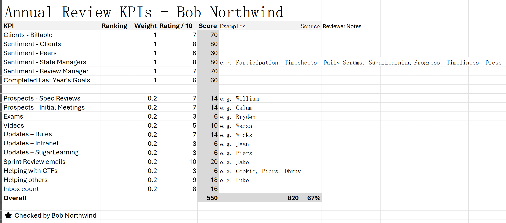

When a company is small, Annual Employee Reviews start as a fairly informal process. The head of the company might take employees for a walk, or generally have a chat about different topics.

As the company grows and more people join, 2 problems start to occur:
1. Reviews start to get longer as scope increases.
2. Other people need to start doing reviews but aren't clear on the processes.

For these reasons, it's important for all the review managers to get aligned about what topics and performance indicators need to be covered, and to ensure scope is limited.

Key Performance Indicators (KPIs) are a tool for standardizing how performance is measured at a company and ensuring employees are aware of what they need to focus on. Then the manager can use the KPIs as a waypoint when doing the Annual Employee Review.

<!--endintro-->

### How KPIs should be used
KPIs are a tool for evaluating employee performance during an Annual Employee Review. 

There should be a standardized list of KPIs that the Review Manager uses to collate scoring data about how well the employee is doing in each area.

Each KPI would have a weight denoting how important it is, and a score denoting how well the employee has done.

The result is a final score and % showing the performance of the employee.

::: good
Figure: Good example - An example of the final output of KPIs  
:::

### Benefits of KPIs
KPIs are beneficial because they provide:
* Standardized metrics for measuring performance
* Clarity around expectations for employees
* Quicker Annual Employee Review

#### Qualitative vs Quantitative KPIs
While many organisations opt for quantitative KPIs, it's difficult to build a system that factors in all the nuance of performance. 

Qualitative KPIs provide more room to make a subjective judgment.

::: warning
KPIs are just 1 indicator of performance, and they do not represent an employee's entire value. Additionally, they may not fit every employee well. Make sure to use KPIs as a talking point and combine it with your personal judgment to perform the final evaluation. 
:::

### Metrics to measure
There's lots of metrics that can be measured, and the right ones are going to depend on what is important to the organization.

Here's an example of what SSW measures

#### Clients - Billable
- How much work have you done for clients?

#### Sentiment - Clients
- How do clients feel about your work?

#### Sentiment - Peers
- How do your peers feel about your work?

#### Sentiment - State Managers
- How does your State Manager feel about your work?

#### Sentiment - Review Manager
- How does your Review Manager feel about your work?

#### Completed Last Year's Goals
- How well have you done completing the goals from last year?

#### Prospects - Spec Reviews
- How many Spec Reviews have you done and what was the quality of your contribution like?

#### Prospects - Initial Meetings
- How many Initial Meetings have you done and what was the quality of your contribution like?

#### Exams
- How many Microsoft and/or Scrum exams have you done?

#### Videos
- How many videos and User Groups have you done?

#### Updates – Rules
- How many Rules have you done and what was the quality of your contribution like?

#### Updates – Intranet
- How many updates to standards in the intranet have you done and what was the quality of your contribution like?

#### Updates – SugarLearning
- How many SugarLearning updates have you done and what was the quality of your contribution like?

#### Sprint Review emails
- How many Sprint Review Emails have you done and what was the quality of your contribution like?

#### Helping with CTFs
- How many CTFs have you helped with and what was the quality of your contribution like?

#### Helping others
- How many ['Checked by xxx'](https://www.ssw.com.au/rules/checked-by-xxx/) emails have you done?
- How many people have you mentored?
- What other ways have you been helping people?

#### Inbox count
- How close is your inbox to 0?
- How happy is your Review Manager with your inbox throughput?
