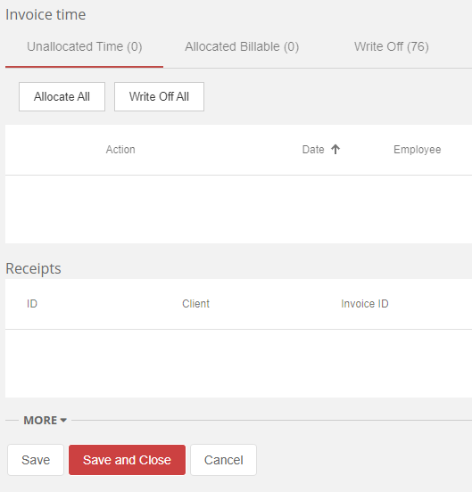

Consistency is a key factor of software development, designing applications that minimise the learning curve through consistent use of componentry and functionality. If buttons with similar functionality are named inconsistently across a web application, it can cause a confusing experience for its users. For example, the buttons used to close a form should be named consistently across your application.

Additionally, buttons should have clear names so the user knows what to expect. For example, it is unclear if a button named **Close** will save (or not save) when closing, so **Cancel** would be clearer.

<!--endintro-->

::: bad  
  
:::

* **Save** button alone is not explicit about the following action for the form (It could close or remain open)
* **Close** could save the fields, then close the form, when the **Cancel** button may be more appropriate

We recommend the web standards of:

* **Save** - Save data without closing the form
* **Save and Close** - Close the form and save any changed data
* **Cancel** - Close the form without saving

::: good  
  
:::
