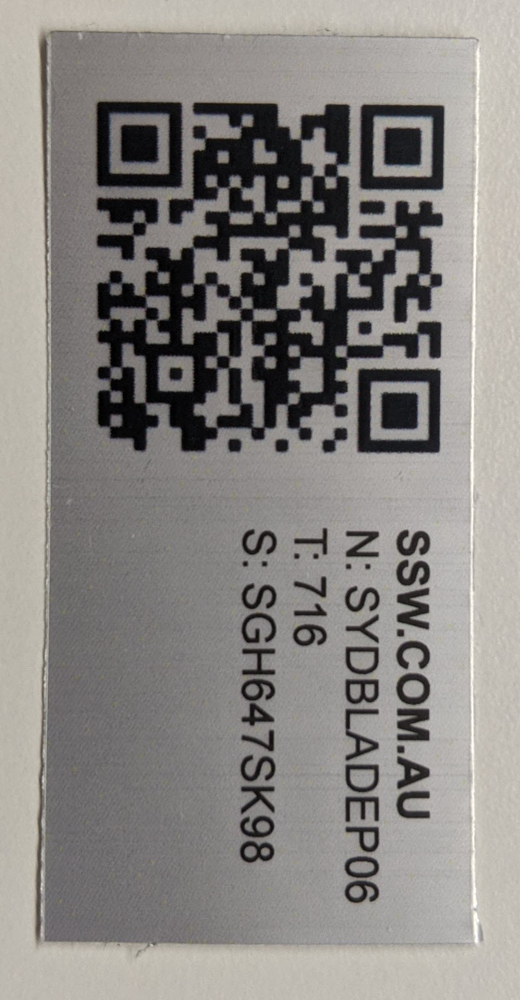

Most companies have physical assets and it's crucial to keep track of those assets - are they in a particular location? Who are the assets with? Are they assigned somewhere else?         

<!--endintro-->

Businesses generally need to provide their employees with a multitude of assets e.g.:

1. Keyboards
2. Mouses
3. Laptops
4. Workstations
5. Mobile Phones

Keeping track of those assets is essential for the business to have any control over them, and having a spreadsheet with values for the assets and all that is not the best approach.

::: bad

:::

In our day and age, we have better (and free!) systems that allow us to track the businesses' assets, including:

1. Purchase Date
2. Order Number
3. Serial Number
4. Model
5. Which location that asset belongs to
6. Which user that asset belongs to (or is in possession of/checked out to)
7. Number of assets
8. And even their depreciation value

All this in a nice UI that allows for you - or even your user themselves - to edit and check out assets.

Tracking is all fun and games, but what about knowing which asset is which? You also need to physically label your assets.

This means that after creating the asset in the system, it generally gets a unique ID within it, and you should generate a label (preferably with a QR or bar code for easy scanning) and attach the label to the asset in question. This makes it super easy to see the asset ID and name at a glance, and, in the case the asset is lost somewhere, anyone can easily scan the QR code and be brought to a site with instructions on how to return or notify the company that asset is lost.

::: good  

:::

::: info
A good system that does all this is [SnipeIT](https://snipeitapp.com/). SnipeIT has a nice interface, easy to use, maintain and upgrade. It generates labels for you, has an API for you to integrate with your current systems and is free if you host it yourself!
:::
