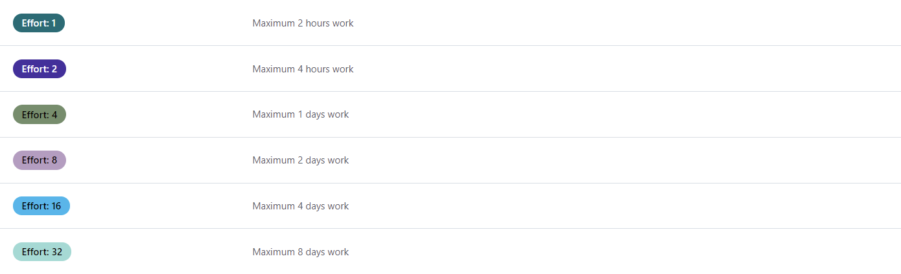
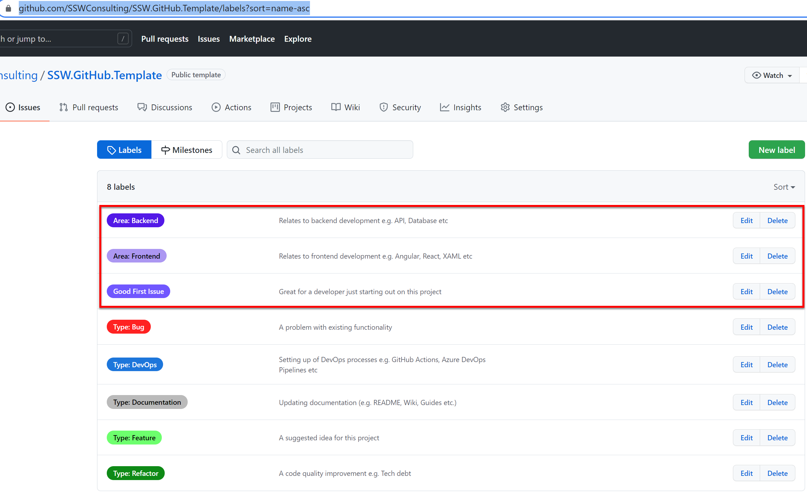

Labels are an important way of categorizing your GitHub Issues. However, it is critical to make sure they are useful, clear and do not overwhelm users. 

The goal is to use consistent labels across all repos. 

Let's take a look at how to make a simple, yet information rich set of labels...

<!--endintro-->

Firstly, set up some [GitHub Issue Templates](/github-issue-templates) that have default labels. Prefix those ones with "Type:" so it is clear they define the type of Issue:
* Type: Bug
* Type: DevOps
* Type: Documentation
* Type: Feature
* Type: Refactor

Also add some extra labels for important ancillary information. Try not to go overboard though, a good example might be 3:

Some labels to define the area of work:
* Area: Frontend
* Area: Backend

And the standard GitHub label to indicate it is a good Issue for developers new to the project:
* Good First Issue

::: bad

:::

Learn more about where Effort labels are appropriate with [GitHub Projects, which has custom fields](/scrum-in-github).

::: good

:::
