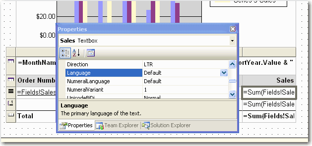
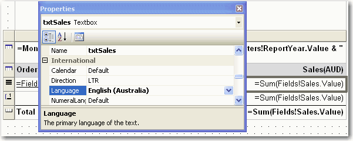
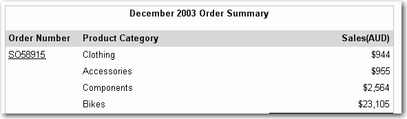
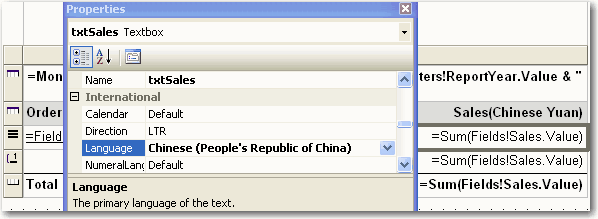
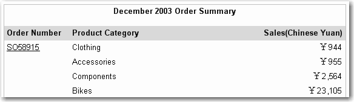
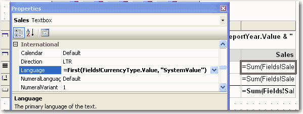

Currency formatting can vary significantly across cultures, and it's important to manage this effectively in your reports.

<!--endintro-->

Although we can make the report support multiple cultures (as per [Do you make sure your language follows the users regional settings?](https://www.ssw.com.au/ssw/Standards/Rules/RulesToBetterSQLReportingServices.aspx#LanguageSetting)), we suggest you don't do this for currency fields. Instead:

1. Have the Language set specifically to the culture you want.
e.g. If you do a report for Australian Dollars, then it should be "English(Australia)"; if for Chinese Yuan, it should be "Chinese(People's Republic of China)". Because the format of currency should not change as per user's culture setting as $100 AUD <> 100 CNY !

2. Have the currency column header set include the currency.
Because $100 USD <> $100 AUD !

::: bad  
  
:::

::: good  

:::

::: good  

:::

If you don't want to get currency fields hard coded in reports, you can use an expression to read settings from your database.

::: good  

:::
