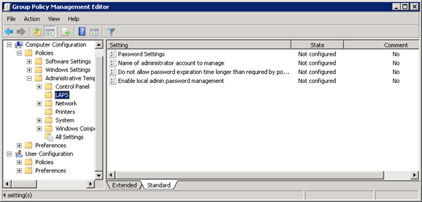

It is best practice to limit the number of administrator accounts in your environment, including local administrators on users' computers. However, it is necessary to have a local administrator account so the computer can be accessed if it loses connection to the domain. **Local Administrator Password Solution (LAPS)** is a great way to manage this account. 

<!--endintro-->

LAPS provides management of local account passwords of domain joined computers. Passwords are stored in Active Directory (AD) and protected by ACL, so only eligible users can read it or request for it to be reset. The passwords are automatically changed regularly - the default is every 30 days, but this can be changed. LAPS is provided by Microsoft, and can be downloaded here: https://www.microsoft.com/en-us/download/details.aspx?id=46899

The download includes a comprehensive operations guide, with step-by-step installation instructions. The high level steps are:

1. Install the management components on management computers (i.e. SysAdmins)\
2. Install LAPS on computers to be managed - this can be done by GPO\
3. Create the AD attributes that will securely store the password\
4. Configure permissions (i.e. make sure only the right people can view passwords)\
5. Enable and configure LAPS by GPO (you can configure password complexity & duration, and more)

To view the password you can use the LAPS UI tool (included with the standard installer), view it in AD Users and Computers, or with PowerShell. You can reset the password with the UI tool or with PowerShell.

