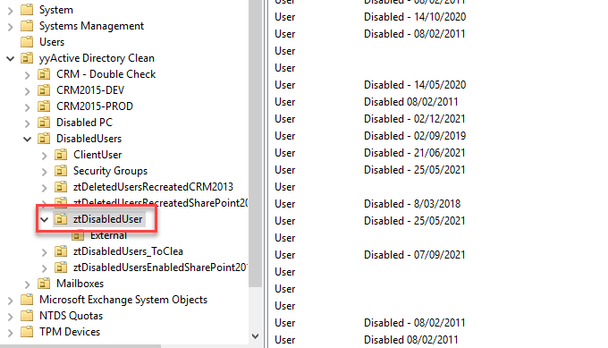

It is important to know what to do with your employees' accounts when they leave. Getting this wrong can create security vulnerabilities - or it can make life difficult for everyone if the employee comes back to work for you again.

<!--endintro-->

### From a System Administrators point of view

You should create a list of instructions that are followed whenever an employee leaves so that the experience is consistent for all and to make sure you don't miss any steps. Here are some important ones - you will need to add more to suit your environment.

1. Change their mailbox to a shared mailbox and check if the email count in the inbox is near 0 (to be done with their manager)
2. Inspect their personal devices such as mobile phones to ensure that company Data has been removed and OneDrive is also removed as per the security measures
3. [Power Automate flows](https://make.powerautomate.com) - Remove ex-employees from the primary owner and add someone else who is eligible to own the flow

   a. Change the owner - Click on Edit | Under owner remove yourself | Add someone else who is eligible to own the flow  

   

   b. Share all the flows with System Administrators and any other groups - Click Share | Type in "Groups you want to share" under Owners | Click OK

   

4. Backup data. Make sure you have a backup of the employee's work. This might include:
   * Check their mailbox, Teams, OneDrive, etc. are in your [Email backup solution](/email-do-you-use-the-best-backup-solution)
      * Alternatively, export their Outlook PST file
   * Files from their computer

5. Remove their AD user account from any group membership
6. Disable their AD account - and any other accounts they have:
   * Move their account to a "disabled users" OU
   * Don't delete their account, this can cause issues in the future!
  
  

7. Forward their emails to another employee
8. Make sure they return any IT equipment they have and delete their computer account/s from AD
9. Remove any security/automation access
