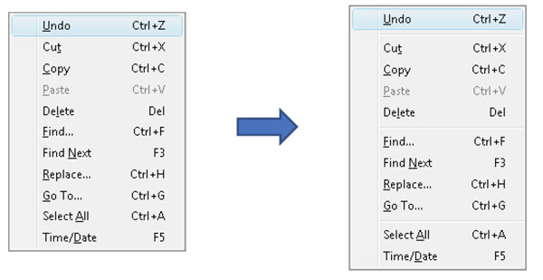
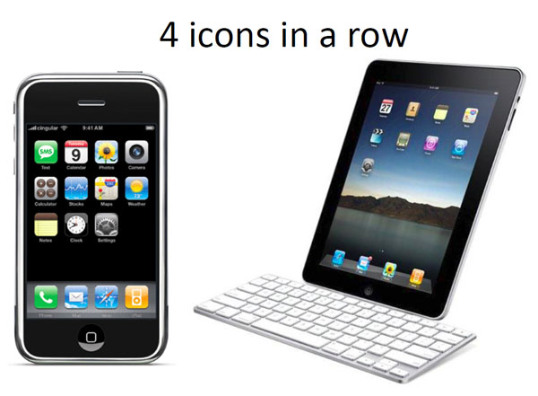
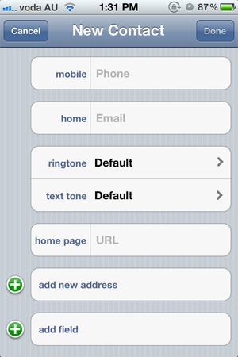

The human brain:

1. Never searches for OR compares all options
2. Prefers smaller sets of options (4 or less)
3. Picks the first option that looks good enough
4. Prefers a shorter option to a longer one
5. Makes a compromise between speed and accuracy

<!--endintro-->

It's important to keep these in mind when making design decisions or presenting data.

Our visual short term memory has a capacity of 4 items. So options are easier for our brain to digest when presented in sets of 4.
<dl class="Image">&lt;dt&gt;&lt;/dt&gt;
<dd>Figure: Blocks of 4 or less menu items are easier for the brain to consume</dd></dl><dl class="goodImage">&lt;dt&gt;&lt;/dt&gt;
<dd>Figure: Even though the iPad has a larger screen estate, it still uses a max of 4 icons across</dd></dl><dl class="goodImage">&lt;dt&gt;&lt;/dt&gt;
<dd>Figure: Good Example - A great example of removing complexity.</dd></dl>
