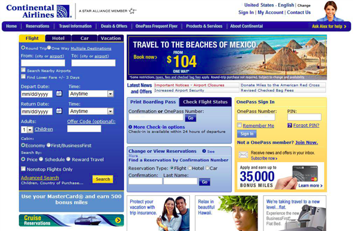
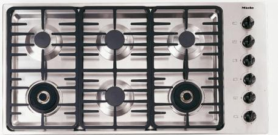

People rarely read word by word; instead, they scan the page, picking out individual words and sentences that seems more relevant.

 <excerpt class='endintro'></excerpt> 
​
It is important to divide information, not show it all at once. The visual organization of information is vital to legibility. When displaying information or controls, designers need to visually convey:

<ol><li>Information structure</li>
<li>Relation between elements</li>
<li>Importance and relevance of elements</li></ol>
<dl class="badImage"><dt></dt>
<dd>Figure: Bad example - Can you find how to check in?</dd></dl>
<dl class="goodImage"><dt></dt>
<dd>Figure: Good example - What about here? Can you find how to check in?</dd></dl>

Another example of scanning, not reading is visually mapping.

<dl class="badImage"><dt></dt>
<dd>Figure: Bad Example - Which is the dial that controls the top-right stove?</dd></dl>
<dl class="goodImage"><dt></dt>
<dd>Figure: Good Example - In this layout, it's easy to see which dial controls which stove</dd></dl>

