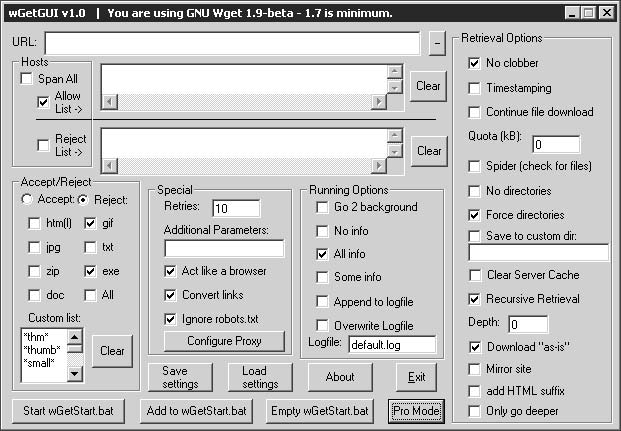
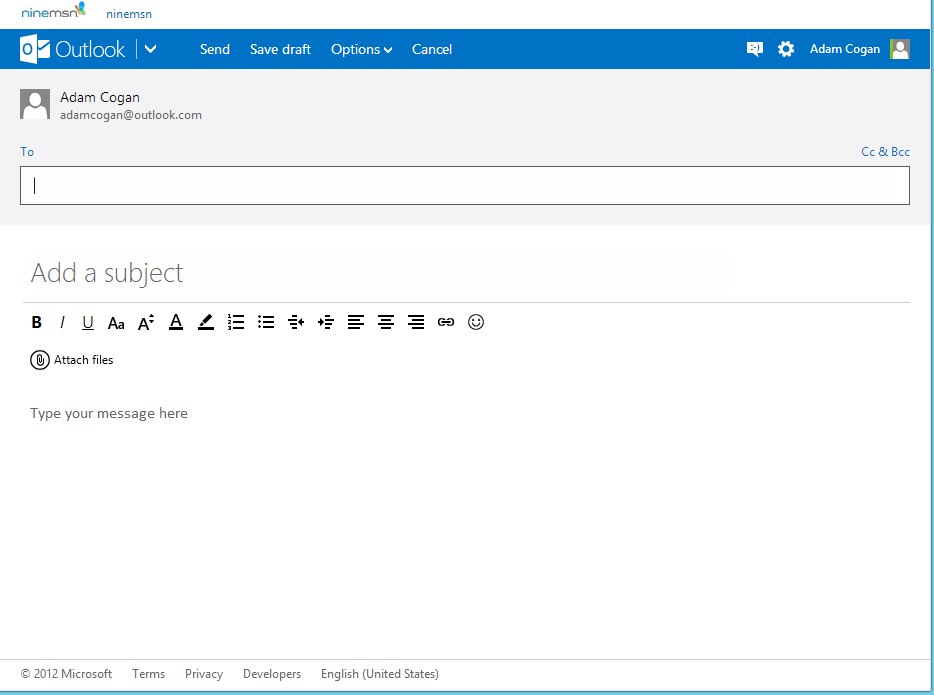

'Less is more' is the idea that simplicity and clarity lead to good design. The interface design is an attempt to solve the problem of how to communicate clearly.

<!--endintro-->

How to make a user interface great:

* Less is more - keep your design as simple and uncluttered as possible
* Understand the importance of defaults - Aim for 'Next', 'Next', 'Next'
* Hide advanced options, but make them easy to find!

Most developers think about user interface last. They spend their time worrying about class design, threading, and system architecture. All this is important, of course. But the user only experiences software on the surface level.

It might be fantastic under the covers, but if the user interface is not intuitive the user will think the application is just hopeless. If the user interface doesn't afford an easy and simple understanding of how to operate the application, you'll get a lot of unhappy customers and unnecessary support calls.

Do yourself a favor, take some time to think about UI first.

::: bad  
  
:::

::: bad  
  
:::

::: bad  
  
:::

::: good  
  
:::
