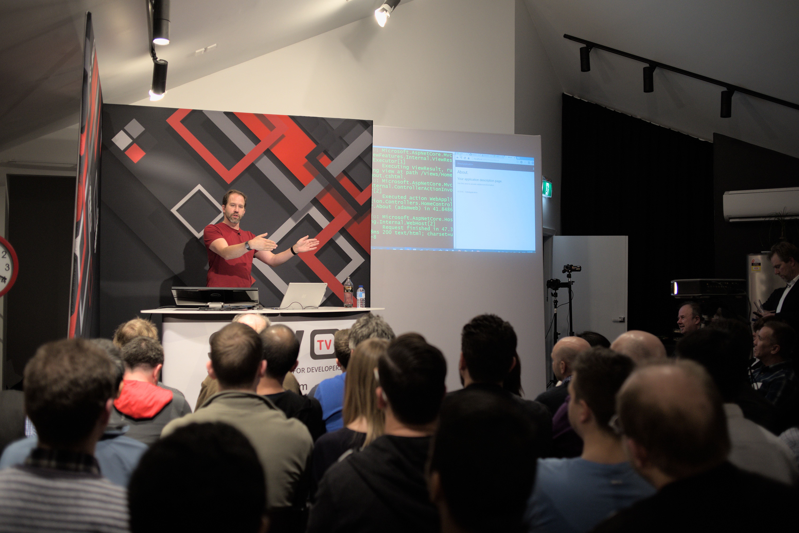

A popular concept in product development and interphase design is the idea of “Less is more”. But what do we actually mean by less is more? 
<!--endintro-->

Let’s start off by defining what it doesn’t mean:

❌ It doesn’t mean that you work less on a project and be able to deliver more

❌ It doesn’t mean we make decisions based on our own personal biases or perceptions of what we think is the easiest solution for the user

❌ It does not mean we include or develop a feature in a design or product just because we have the technical ability to do so

✅ When we talk about "Less is More", we are talking about simplifying the way we present ideas to focus the user on making decisions about a task in the most effective way possible.

Here are a few helpful ways we can employ a “Less is more” approach:

## Leave it out

> "Just because we can does not mean we should"

Including a design element, feature or product enhancement, because we have the technical ability to do so with no impact on the user experience. It could overcomplicate a simple task, cause cognitive overload and ultimately distract an audience from processing through a task with less friction. It’s Equally as important to leave out a good idea than it is to include one, especially if it doesn’t help the user achieve their goals.

::: bad 

:::

::: good

:::

Setting a bar or standard of minimum requirements for every new feature you would like to add would be a good way to measure and decide if it enhances the user experience and if it’s really necessary to add.

## Keep it simple

By keeping things simple we reduce complexity and avoid the cognitive overload required for a user to make an informed decision. We want to keep things easily digestible to as broad an audience as possible. Again mainly focus the user on the completion of a task. 

Using simple descriptive language or a minimalist design approach can often demystify complicated topics and make information easily digestible so that users can make decisions with ease.

::: bad 

:::

::: good

:::

## Empathise with the user

The word empathise means that you start to subjectively put yourself in the user’s shoes and try to experience what they are feeling. Try to forecast how your design choices will impact other productions that might use it.

Don’t forget! Most users will only invest time if it benefits them and if it is easy to process a task with minimum frustration. A large portion of users will disengage with your content if you make it harder for them to digest.

::: bad 

:::

Defining user empathy at various stages will help you develop a deeper understanding of the user's needs and ultimately help your products or assets to be used over and over again.

Developing empathy maps for a user might be a handy tool to use when you are trying to empathise with the user.

`youtube: https://www.youtube.com/embed/QwF9a56WFWA`
**Video: What is an Empathy Map?**
