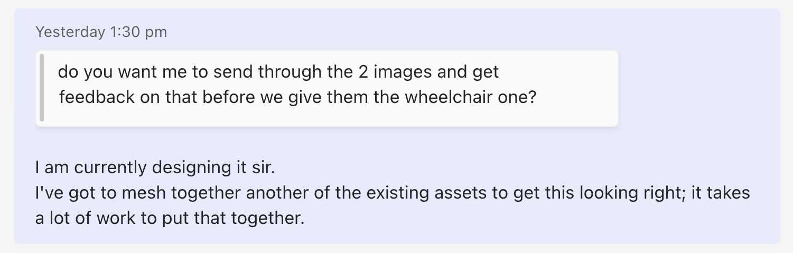
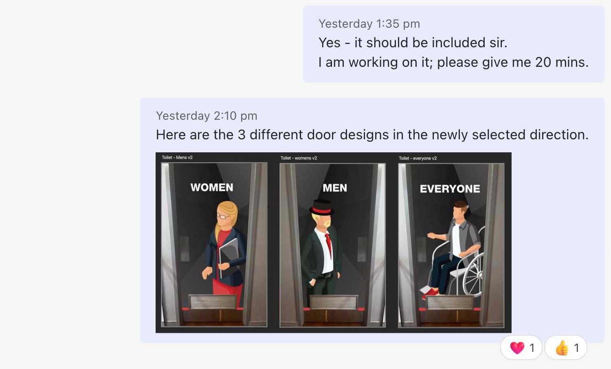

"Less is more" is a popular concept in design and aesthetics, which suggests that simplicity and minimalism can be more effective and powerful than complexity and abundance. It emphasizes the idea that having fewer elements or features in a design or an object can often result in a more compelling and impactful outcome.

But what does “less is more” mean? 

<!--endintro-->

✅ "Less is more" is about simplifying the way we present ideas to focus the user on making decisions in the most effective way possible

❌ It doesn’t mean that you work less on a project and be able to deliver more

❌ It doesn’t mean we make decisions based on our own personal biases or perceptions of what we think is the easiest solution for the user

See some helpful ways to apply a “Less is more” approach:

### Leave things out

> "Just because we can does not mean we should"

It's fairly common to include design elements, features, or product enhancements solely based on technical ability to do so, without considering their impact on user experience. This approach can unnecessarily complicate a simple task, overwhelm users with excessive information, and ultimately divert their attention from completing the task at hand.

It’s equally as important to leave out a good idea than it is to include one, especially if it doesn’t help the user achieve their goals.

::: bad 

:::

::: good

:::

Setting a bar or standard of minimum requirements for every new feature you would like to add would be a good way to measure and decide if it enhances the user experience and if it’s really necessary to add.

### Keep things simple

By keeping things simple we reduce complexity and avoid the cognitive overload required for a user to make a decision. We want to keep things easily digestible to as broad an audience as possible. Again, the main focus is on the user achieving their goals. 

Using simple descriptive language or a minimalist design approach can often demystify complicated topics and make information easily digestible so that users can make decisions with ease.

::: bad 

:::

::: good

:::

### Empathize with the user

The word empathize means that you start to subjectively put yourself in the user’s shoes and try to experience what they are feeling. Try to forecast how your design choices will impact other productions that might use it.

It's important to remember that users are typically only willing to invest their time in something if it directly benefits them and if the process is simple and frustration-free. If your content is difficult for them to understand, a significant portion of users may become disengaged and lose interest.

::: bad 

:::

Defining user empathy at various stages will help you develop a deeper understanding of the user's needs and ultimately help your products or assets to be used over and over again.

Developing empathy maps for a user might be a handy tool to use when you are trying to empathise with the user.

`youtube: https://www.youtube.com/embed/QwF9a56WFWA`
**Video: What is an Empathy Map? (5 min)**
