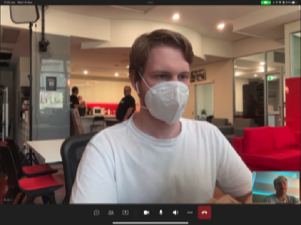

We live in a complicated world with too many distractions, where information overload is commonplace. “Less is more” is all about keeping things simple and achieving a design with the least number of elements required to deliver a message effectively.

<!--endintro-->

`youtube: https://youtu.be/8BRcWBwkK04`
**Video: Less is more (5 min)**

### Keep it simple

> "Just because we can does not mean we should"

It is common to include design elements, features, or product enhancements solely because we think we should. This approach can unnecessarily complicate a design and overwhelm a user. 

### Applying "Less is more"

#### Thumbnail designs

::: bad

:::

::: good

:::

By keeping things simple, we reduce complexity and avoid cognitive overload for our users. Making simple changes like using shorter, more descriptive language or minimising the overall number of design elements will make the overall message of a design much clearer to understand.

#### UI interface

::: bad

:::

::: good

:::

#### Stage background

::: bad

:::

::: good

:::

#### Office layout

::: bad  

:::

::: good  

:::

So next time you think about designing something, try to keep it simple and remember... “less is more”.

