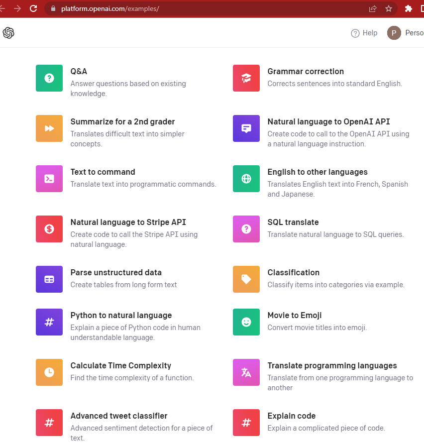

GPT-3 has an [awesome API](https://openai.com/api/) and [Azure services](https://azure.microsoft.com/en-us/products/cognitive-services/openai-service) that you can easily wire into any app. 

<!--endintro-->

First, figure out what you want to do with GPT-3. There are hundreds of use cases, OpenAI even maintain a [list of examples](<>)

Next, it's as simple as plugging in the relevant service to an app!