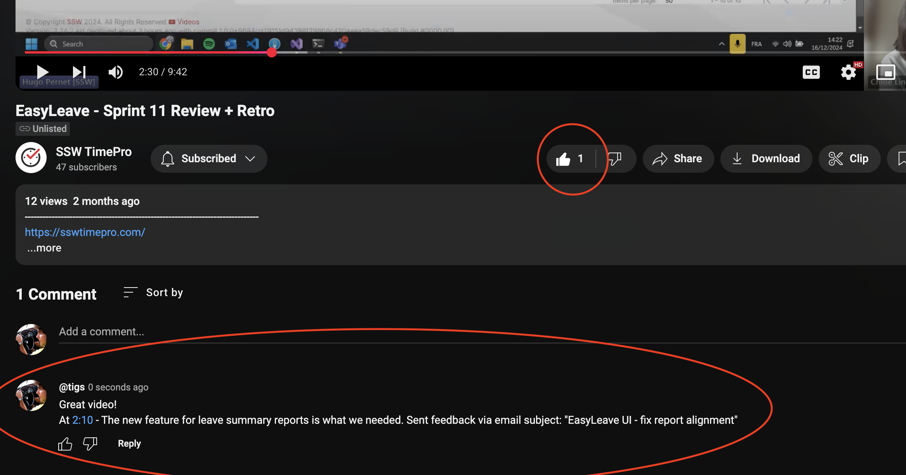

Engaging with important videos by liking and commenting not only boosts their performance but also benefits creators and viewers. This is especially valuable for [test-related](/conduct-a-test-please) content.

<!--endintro-->

If you're a video creator, encourage testers to like and comment on videos to confirm they've watched and to gather their valuable feedback.

These video interactions help build a history, like who are the viewers and their thoughts.

::: good

:::
