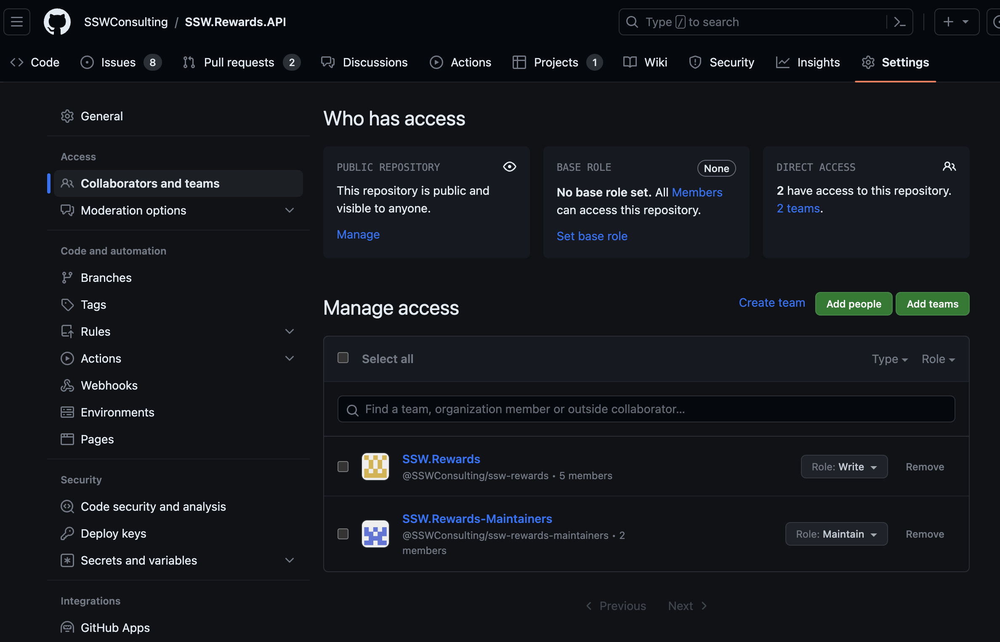

Increasing a member's permissions also increases the amount of damage they can do. As a good rule of thumb, only give members the access that they need to complete their work. 
e.g. You do not want developers to have force-push permissions on the main branch, as they might accidentally delete branches and code by mistake!

::: greybox
💡 Tip: GitHub has a role called "Maintainer" which is like an Admin but without the destructive powers
:::

::: greybox
⚠️ Note: If you are still using Azure DevOps, force-push permissions into a repo is only allowed for Project Administrators, so pick your administrators well.
:::

See GitHub docs [Repository permission levels for an organization](https://docs.github.com/en/github/setting-up-and-managing-organizations-and-teams/repository-permission-levels-for-an-organization)

::: bad

:::

::: good

:::