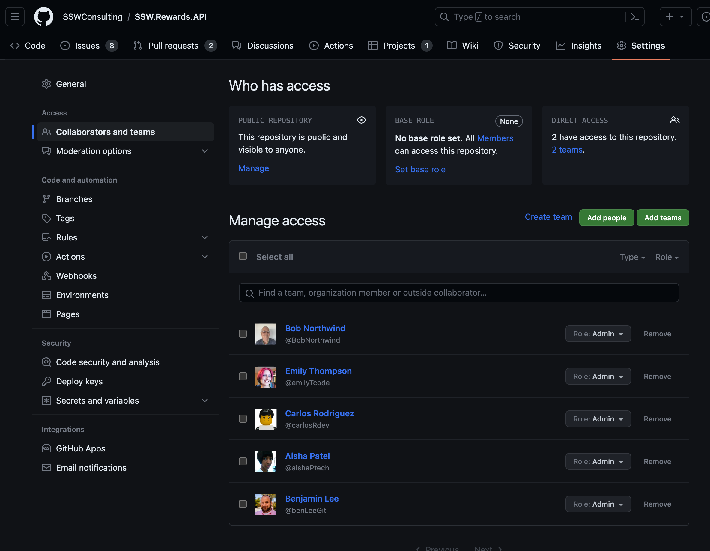

Increasing a member's permissions also increases the amount of damage they can do. As a good rule of thumb, only give members the access that they need to complete their work.

See GitHub docs [Repository permission levels for an organization](https://docs.github.com/en/github/setting-up-and-managing-organizations-and-teams/repository-permission-levels-for-an-organization)

::: bad

:::

::: good

:::

