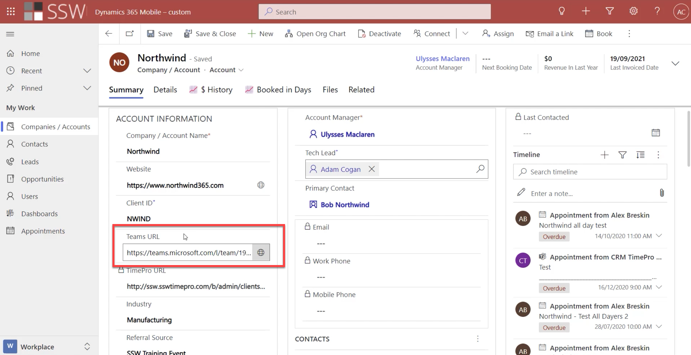

If you use a Team per client, it is likely that you want to have a link between your Teams instances and the associated CRM record.

<!--endintro-->

At SSW we have a custom property for each client that stores the Teams URL:

### Simple:

To get that URL, simply click the ellipsis next to your Team name and click "Get link to Team"

This process can even be automated using Azure functions and Graph API to provision a new Team every time a new client is created in CRM.

### Medium: 

**TODO: Lu to update**

### Optimal (Recommended) 

This process can even be automated using Azure functions and Graph API to provision a new Team every time a new client is created in CRM.

Click on this section on your CRM Dynamics to have a Team created:

