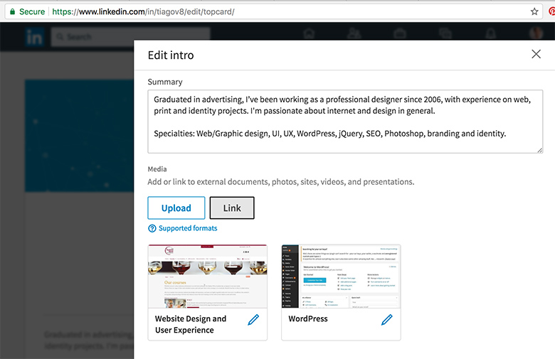
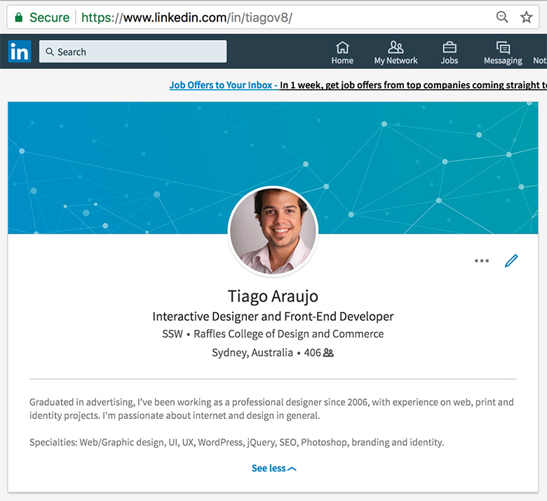
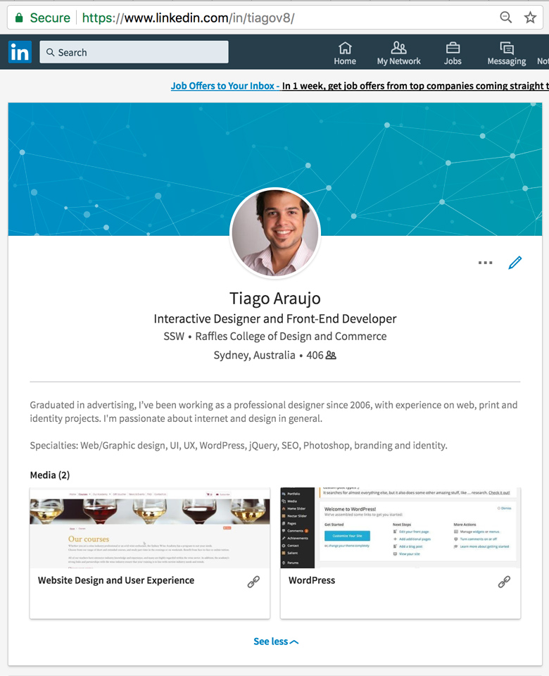

LinkedIn is the main business and employment-oriented social networking service available. It's important to keep it up-to-date and link it to your company's services.

<!--endintro-->
<dl class="image">&lt;dt&gt;  &lt;/dt&gt;<dd>Figure: Use the "Link" button in your profile "edit mode" to include the URLs for the main services your provide</dd></dl><dl class="badImage">&lt;dt&gt;&lt;/dt&gt;<dd>Figure: Bad example - Profile with no links</dd></dl><dl class="goodImage">&lt;dt&gt;&lt;/dt&gt;<dd>Figure: Good example - Profile with links to main services provided  </dd></dl>
