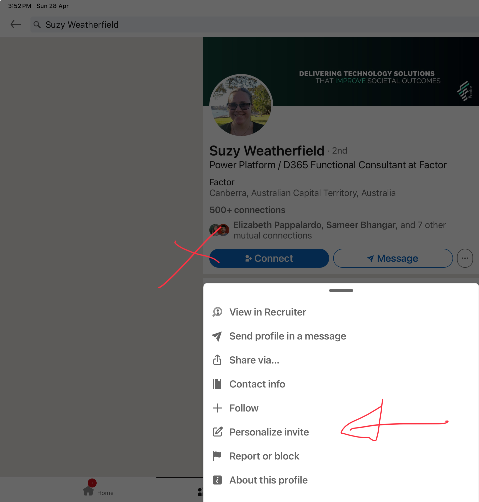
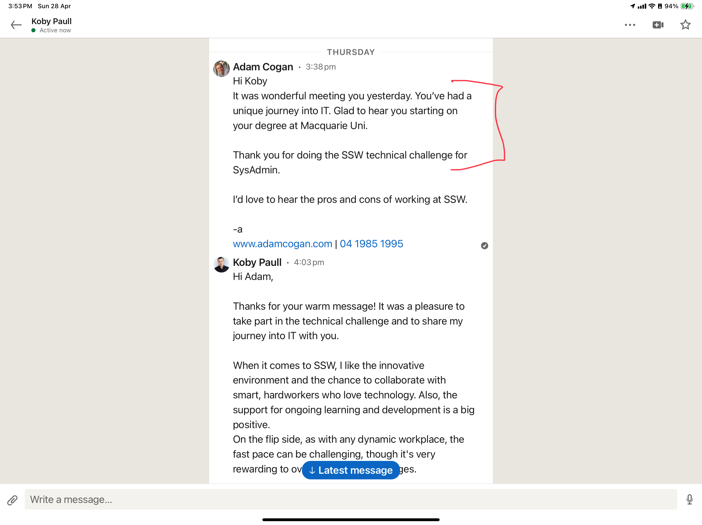

Networking platforms like LinkedIn are essential for connecting with professionals in your industry. As your network grows, recalling the specifics of each interaction becomes increasingly challenging. To foster meaningful relationships, personalize your connection requests!

<!--endintro-->

## When Connecting with someone on LinkedIn

1. **On the LinkedIn mobile app** - avoid using the default "Connect" or "Message" buttons. Instead, use the "ellipsis | Personalize invite" button to craft a custom message.

   On the LinkedIn website - click "Connect | Add a note"

::: good

:::

2. **Craft your custom message** - Begin your message with a friendly greeting, such as "Hey {{ NAME }}, it was great talking to you.". Provide context by mentioning where and how you met and if applicable, mention shared interests or topics discussed to help both parties recall the conversation. Make sure not to come across as too salesy.

::: good

:::

::: greybox
Hi Bob 👋,

I've heard that you're interested in Tina CMS.Our team has extensive experience in implementing Tina CMS for various clients, and we'd love to help you too. How about we organize a meeting with our account manager this week to discuss the details? 😃
:::
::: bad
Figure: Bad example - Don't be too salesy!
:::

By using this technique, you can create memorable connection experiences, making it easier to build and maintain professional relationships down the track.

::: info
**Monthly limit**

By default you can only send [5 custom messages per month](https://www.linkedin.com/help/linkedin/answer/a563153), which should be enough. If you want to be able to send more customized messages you will need to upgrade your LinkedIn plan to Premium.
:::
