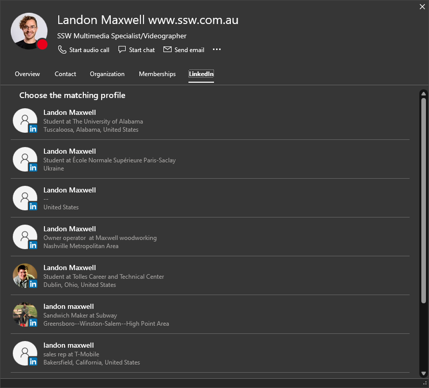
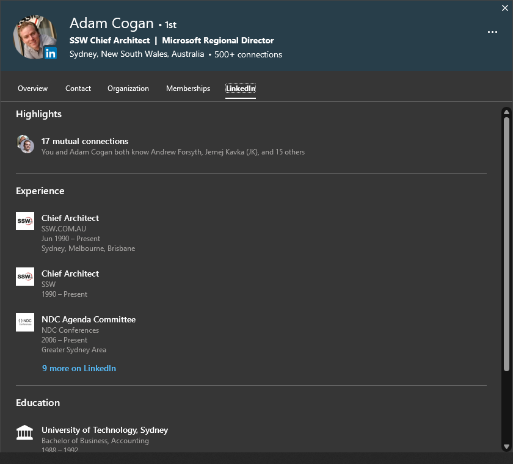
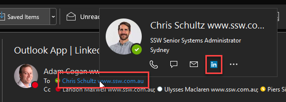
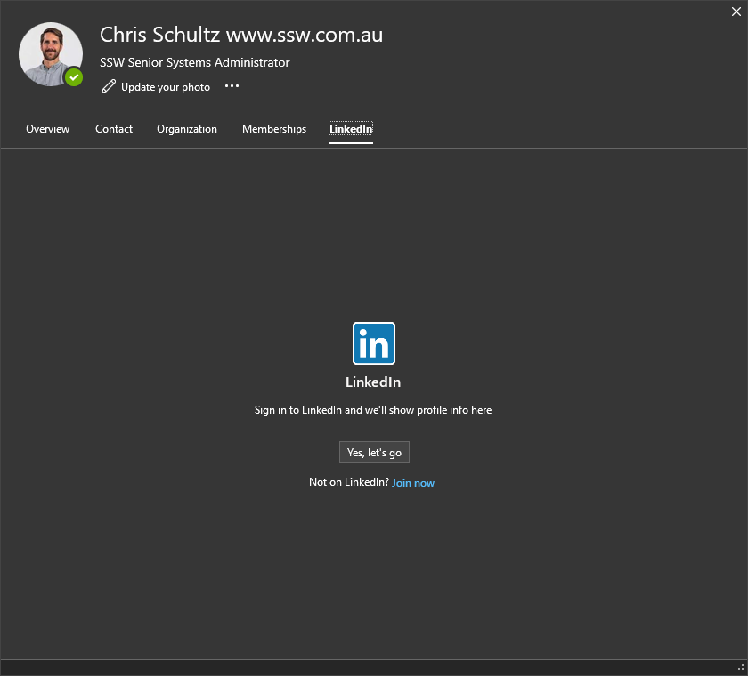
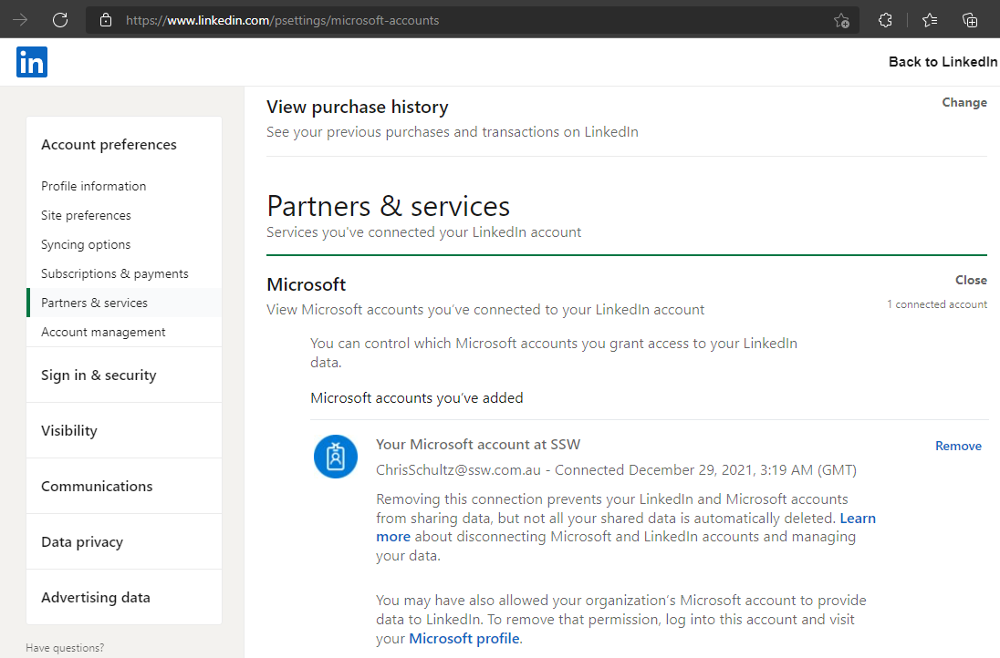

Outlook (and other Microsoft 365 apps) has a great feature that shows users' LinkedIn profiles - but only if the user has connected their Microsoft account.

<!--endintro-->

::: bad

:::

::: good

:::

To connect your Microsoft account

1. In Outlook, hover over your name (for example, in an email to you) and click on the LinkedIn logo

2. On the LinkedIn page that appears, click "Yes, let's go"

::: greybox

**Note:** If your Microsoft account is already connected, you'll see your LinkedIn profile here instead.

:::

3. Follow the prompt to sign in to LinkedIn, and allow access to your account
4. Hover over your name again, click the LinkedIn logo and see your profile appear

You can also check this within LinkedIn. go to **LinkedIn | Settings | Account Preferences | Account Management | [Microsoft](https://www.linkedin.com/psettings/microsoft-accounts)**, and view your account connection.

- - -

### Links

See also: [Microsoft's Support page on this topic](https://support.microsoft.com/en-us/office/connect-your-linkedin-and-personal-accounts-658686da-b158-44c9-bf0f-56b23b70ef5f)
