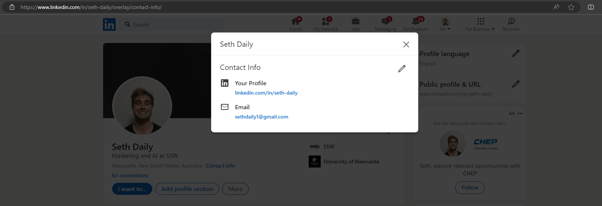
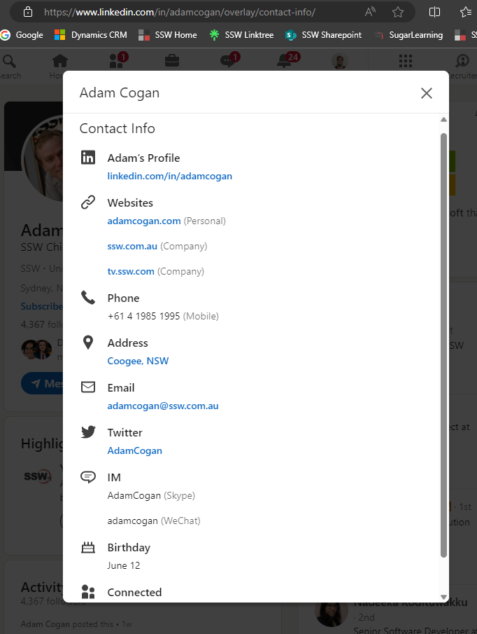
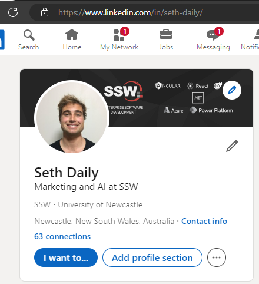
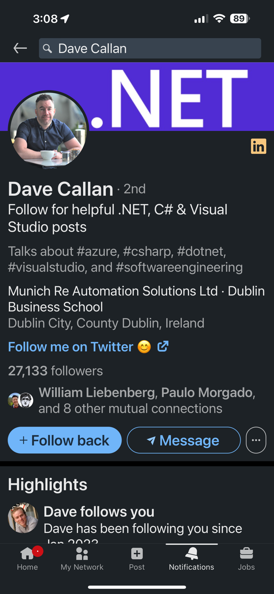

You've met a potential client and they search you up on LinkedIn. They're interested in what you have to offer but want to learn more about you. They go to your LinkedIn profile only to find that you haven't provided any links to your website or other social platforms. That's not good! So what's the best way to fix it?

<!--endintro-->

## Why it's important

Adding relevant links to the contact info section on LinkedIn serves multiple purposes. It solidifies your credibility by providing additional platforms where people can learn more about you. It also increases your general online visibility which is a step in the right direction for networking and a competitive advantage in the online social marketplace.

::: bad

:::

::: good

:::

## How to add links to your contact info

1. Open LinkedIn and go to your profile
2. Click on 'contact info' in your bio
3. Click the pencil icon in the top right of the popup box
4. Use '+ Add website' to add links to your:
    * Profile page on your company website
    * X handle
    * Blog/website
    * Other platforms where you're active

If you have LinkedIn premium, you can add a cool link to your X (Twitter) page.

::: bad

:::

::: good

:::

## How to add a custom link (Premium only)

1. Open LinkedIn and go to your profile
2. Click on the pencil on the right side of your bio
3. Scroll to the section called **Custom Actions**
4. Add a link
