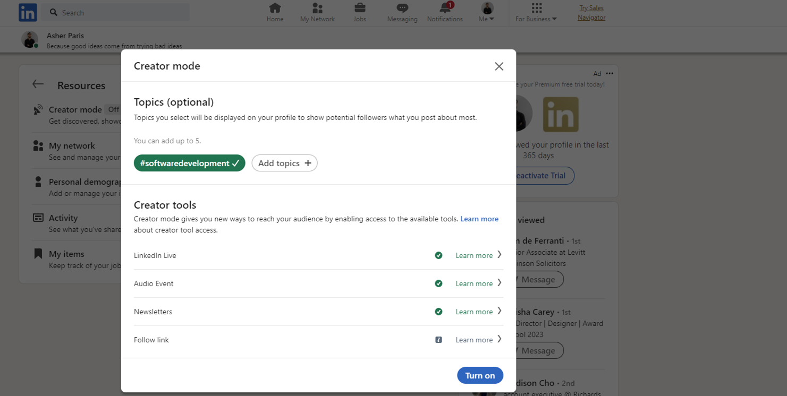

Creator mode is a profile setting that can help you grow your reach, influence and audience on LinkedIn. 

<!--endintro-->

You can turn on creator mode to get access to additional tools and features that help you create content and grow your audience base on LinkedIn.
  
For example, you can add topics you post the most about in the form of hashtags.

::: bad

:::

**How to turn on Creator mode**

1. Go to your LinkedIn profile
2. Scroll down and click 'Creator mode'

3. Include relevant hashtags
4. Click 'turn on'

 

::: good

:::
