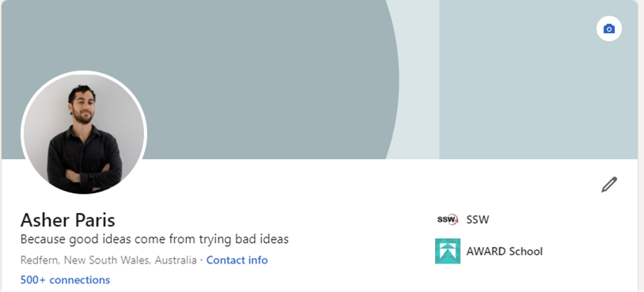
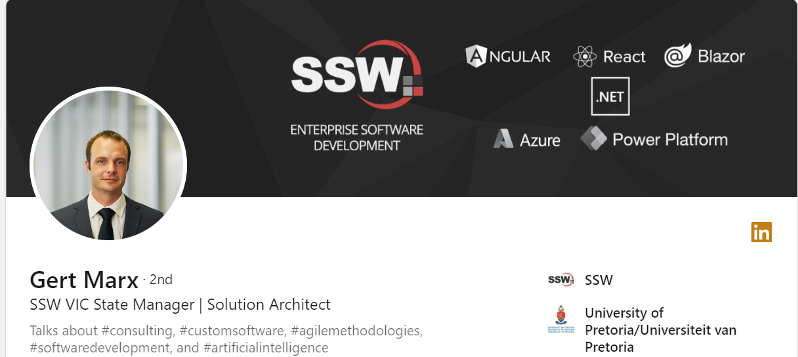
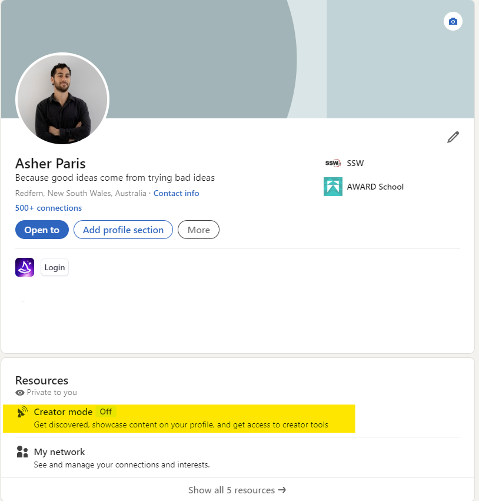
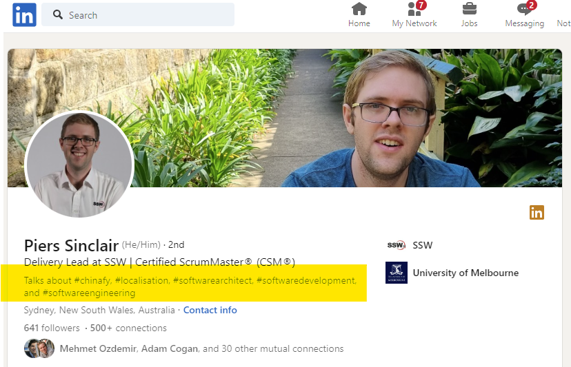

[Creator mode](https://www.linkedin.com/help/linkedin/answer/a522537) is a profile setting that can help you grow your reach, influence and audience on LinkedIn.

You can turn on creator mode to get access to [additional tools and features](https://www.linkedin.com/help/linkedin/answer/a529748) that help you create content and grow your audience base on LinkedIn.

<!--endintro-->

For example, you can add topics you post the most about in the form of hashtags so users can find your profile when they are searching for a topic they want to learn more about.

::: bad

:::

::: good

:::

#### **How to turn on creator mode**

1. Go to your LinkedIn profile
2. Scroll down and click 'Creator mode'

3. Include relevant hashtags
4. Click 'turn on'

::: good

:::

::: good

:::
