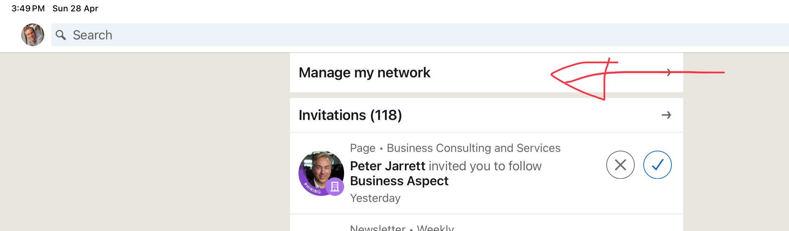

Finding returning work or even new client work can be difficult at the best of times. But it becomes even worse when you don't know how to maintain your network and give it the care that it deserves.

<!--endintro-->

Maintaining your connections is primarily about keeping yourself at the front of someone's mind. This way if they have a problem, they think of you!
This becomes much easier when you [use personalized invites](/linkedin-connect-with-people) to help you both remember each other.

## Reaching out to someone you knew well

Imagine you're wanting to reach out to a previous client or acquaintance.

::: greybox
Hi Bob 👋,

I've heard that you're interested in Tina CMS. Our team has extensive experience in implementing TinaCMS for various clients, and we'd love to help you too. How about we organize a meeting with our account manager this week to discuss the details? 😃
:::
::: bad
Bad example - Don't be too salesy! How would you respond to this?
:::

::: greybox
Hey Bob 👋,

I recall your website was using Contentful, but I saw you're interested in TinaCMS!

My team and I have recently moved over to TinaCMS, and it's been an awesome experience for editing.

What prompted you to look into a change? 😃
:::
::: good
Good example - You've shown interest, but not asking for work
:::

## Reaching out to an old Connection

Imagine you're wanting to reach out to a random Connection on LinkedIn from years ago.

You can use the "Manage My Network" page in LinkedIn by going to **My Network** | **Manage My Network** | **Connections** by default, they are sorted by most recent connection.

::: greybox
Hi Sara 👋,

I see that you're working at company using .NET Framework 4.7.2. Wow, that's old!

If you'd like, I can put you in touch with my Account Manager for an initial meeting to upgrade to .NET 8?
:::
::: bad
Bad example - Too salesy, and a bit rude?
:::

::: greybox
Hey Sara 👋,

I saw that we're alumni from the same university, and that you're working at Atlassian!

How are you enjoying working on that cool tech?
:::
::: good
Good example - You're re-introducing yourself and kicking off a conversation
:::
