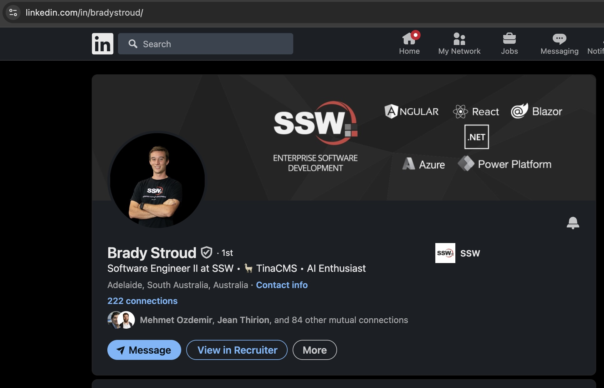

Clients look at LinkedIn to learn about consultants. Since it's often the first impression, a LinkedIn profile should be clean and professional. It's most important to be accurate and clear - it doesn't need to be complicated.

<!--endintro-->

Do the following on your profile page:

1. Use a [great profile photo](/profile-photos)
2. Add a nice branded banner image ([see example](blob:https://sswcom.sharepoint.com/30d450d2-2ff2-422a-8bed-1a02a9c5747f))
3. [Add the company name before your position](/prefix-job-title)
4. [Add a friendly URL](/create-friendly-short-urls) - See [how to](https://www.linkedin.com/pulse/how-simplify-your-linkedin-url-brenda-meller-zawacki-/)
5. [Include other social media](/linkedin-contact-info)
6. Add your top skills in the 'About' section (Aim for 5)
7. [Use hashtags](/linkedin-creator-mode) to make yourself searchable
9. Add a link to your company's profile in your description. E.g. <https://www.ssw.com.au/people/{{> YOUR-NAME }}
10. Account Managers - include a button to book ([Do you know the best way to let clients book a meeting with you?](https://www.ssw.com.au/rules/meeting-bookings))

::: good

:::
