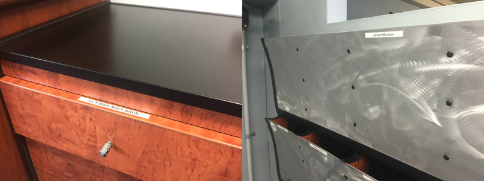
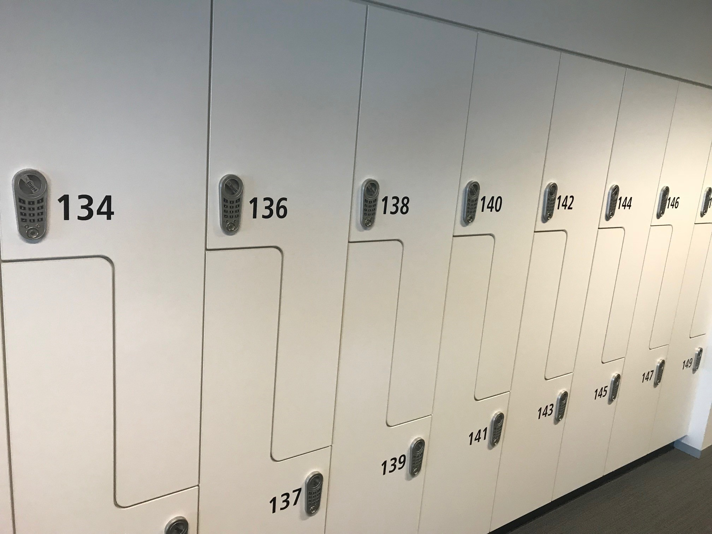
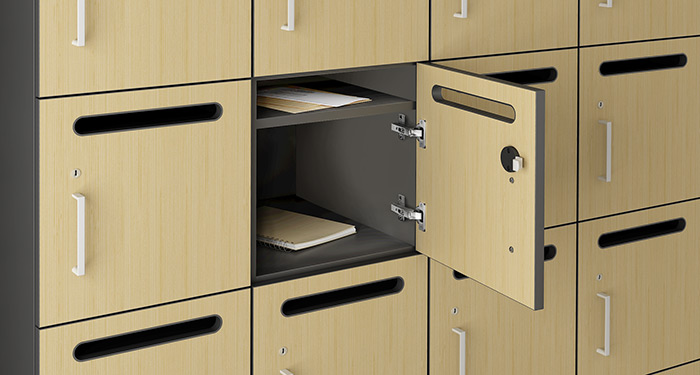

It's important to provide a physical space for each employee to store their stuff and as a bonus they can also receive packages and mail. Lockers should:

<!--endintro-->

* Be clearly labelled with the staff members name
* Ideally, should have a slot for mail
* Ideally should be half-height so you can hang a shirt or a jacket
* Encourage the goal of a clean desk policy
* Encourage the chucking of paper - it should not be a place to keep all of your scraps of papers. Paper tends to get lost and should be transferred to tasks as 'To Myself' emails and then chuck. See [Rules to better Email](/rules-to-better-email) for more information.

::: bad

:::

::: ok

:::

::: good
 
:::
