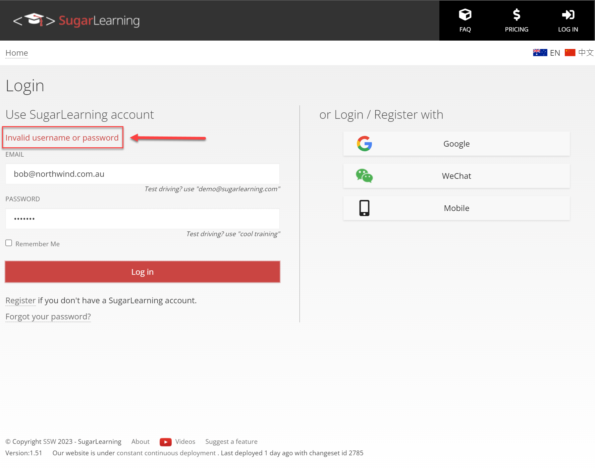

When a user fails to sign in due to an invalid email or password, you might have the well intention of letting them know by telling them exactly which one is invalid.

However, this is not secure. It makes it easier for bad guys (hackers) to get access to your account and do malicious things using your information.

A more secure and prudent approach involves delivering a message that simply states 'Invalid email or password.' This intentionally avoids disclosing which specific credential is incorrect, thereby enhancing security by limiting the information exposed to potential threats.

<!--endintro-->

::: good  
 
:::
