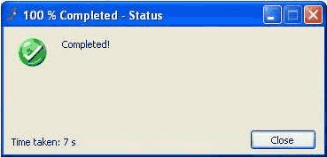

Whenever a long process is churning away (e.g. about 10 seconds) users will usually do something else, either make a coffee or switch to another window.

<!--endintro-->

Your application should remind the user to go back and check on it by:

* Playing a sound
* Hiding the progress bar
* Showing a message box at the end of the long process

See rule on [Do you know how to make long-running processes user-friendly?](http://www.ssw.com.au/ssw/Standards/Rules/RulestoBetterInterfaces-Windows-Applications.aspx#LongProcessFriendly)

When using Message Box to indicate user a process is done, always includes detailed summary of the process. Don't just say "Process completed."
<dl class="badImage">&lt;dt&gt;
Process completed. 
&lt;/dt&gt;
<dd>Figure: Bad example – No detailed information</dd></dl>
This is just like standing at a set of traffic lights listening for the beep to know when to walk, rather than constantly looking at the red and green lights.
<dl class="goodImage">&lt;dt&gt;&lt;/dt&gt;
<dd>Figure: OK Example - A completed progress form</dd></dl><dl class="goodImage">&lt;dt&gt;
Manual extraction process completed.  Mailboxes scanned: 8 Mailboxes skipped: 2 Total mailboxes: 10 Time Taken: 10 minutes, 15 seconds 
&lt;/dt&gt;
<dd>Figure: Good example – The user can see what has been processed</dd></dl>
