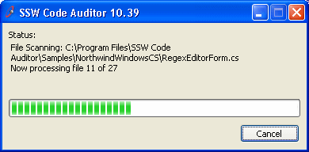
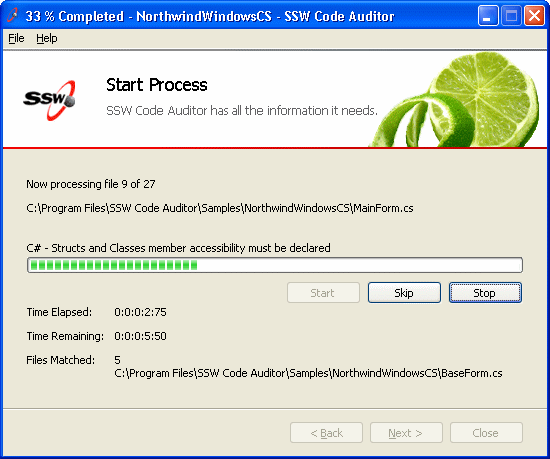

The importance of having the status of progress bar on winform's title:

* Users can clearly see the progress status.
* If the winform is minimized to taskbar, users still can see the progress status.

<!--endintro-->

The form title should take the form of "[XX]% Completed - [Task Description] - [Product Name]".
There is another relevant rule about the [winform title](http://www.ssw.com.au/ssw/Standards/Rules/RulestoBetterInterfaces-Windows-Applications.aspx#TitleBarCaption).
<dl class="badImage">&lt;dt&gt;&lt;/dt&gt;
<dd>Figure: Bad Example - The winform's title does not contain the progress status</dd></dl><dl class="goodImage">&lt;dt&gt;&lt;/dt&gt;
<dd>Figure: Good Example - The winform's title contains the status of progress bar</dd></dl><dl class="goodImage">&lt;dt&gt;&lt;/dt&gt;
<dd>Figure: Good Example - You can clearly see the progress status from taskbar when you have the windows minimized</dd></dl><dl class="goodImage">&lt;dt&gt;&lt;/dt&gt;
<dd>Figure: Good Example - Windows 7 shows the progress in the taskbar (which is visible even when the application is minimized)</dd></dl>
