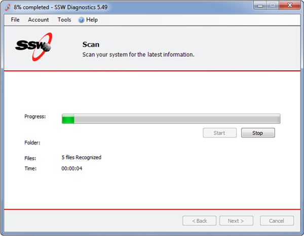
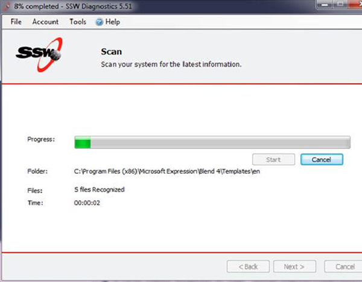

When stopping processes, you should use 'Cancel'... Not 'Stop'. The meaning of 'Cancel' is clearer to users, as opposed to 'Stop' which might also mean 'Pause'.

<!--endintro-->
<dl class="badImage">&lt;dt&gt;&lt;/dt&gt;
<dd>Figure: Bad Example - Stop is an ambiguous term and can be momentarily confusing</dd></dl><dl class="goodImage">&lt;dt&gt;&lt;/dt&gt;
<dd>Figure: Good Example - Cancel leaves little room for miscommunication</dd></dl>
