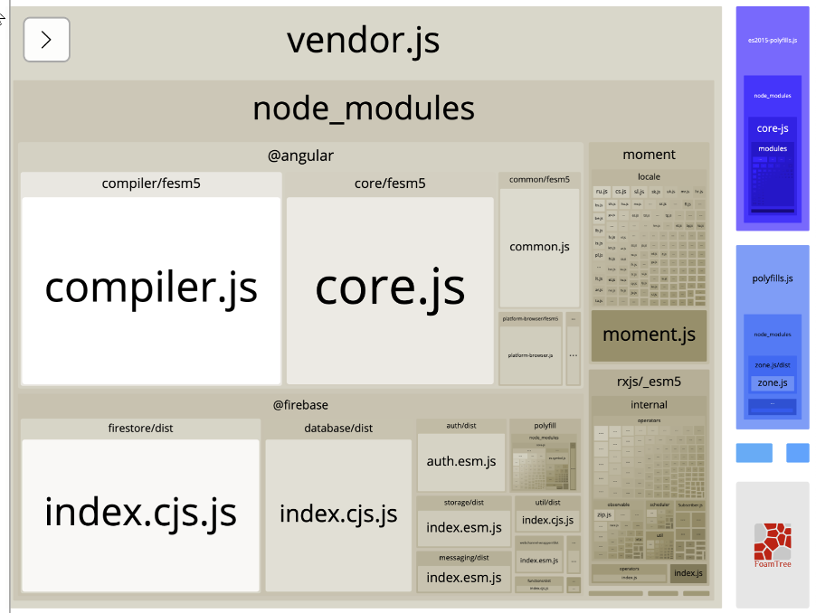

JavaScript projects (for example using Angular, React, or Vue) can have unnecessary libraries that take excessive size in the build bundle. It can cause huge impacts on the performance of the application.

<!--endintro-->

JavaScript bundle analyzers are tools that visualize the sizes and dependencies of libraries used in JavaScript projects. It helps to monitor the size of the compiled bundle in order to maintain the optimal performance of the final build.

Here are a few options for the bundle analysis in JavaScript projects:

### For Angular projects use webpack-bundle-analyzer 

This is a popular tool for Angular projects which analyses a webpack stats JSON file generated by the Angular CLI during the build. To produce the bundle analysis using **webpack-bundle-analyzer** in Angular projects, follow the [instructions in this blog](https://www.digitalocean.com/community/tutorials/angular-angular-webpack-bundle-analyzer).

::: good  
  
:::

### For React projects sadly webpack-bundle-analyzer is too hacky to get going 

Unfortunately, the create-react-app from version 3 has removed the “--stats" flag which produces the webpack stats file used by webpack-bundle-analyzer. Hence, webpack-bundle-analyzer can only be used as a plugin in these React projects, as described in the following blog: [Optimize your React application with webpack-bundle-analyzer](https://medium.com/@hamidihamza/optimize-react-web-apps-with-webpack-bundle-analyzer-6ecb9f162c76)

::: bad  
  
:::

### For React projects use source-map-explorer

This tool uses a bundle's generated source map files to analyse the size and composition of a bundler and render a visualization of the bundle similar to what **webpack-bundle-analyzer** does. To create a bundle analysis for a React project, follow the instructions from the Create React App documentation: https://create-react-app.dev/docs/analyzing-the-bundle-size/

::: good  
  
:::

Screenshots of these diagrams should be included in the project's wiki as per the rule [Do you make awesome documentation?](/do-you-review-the-documentation)
