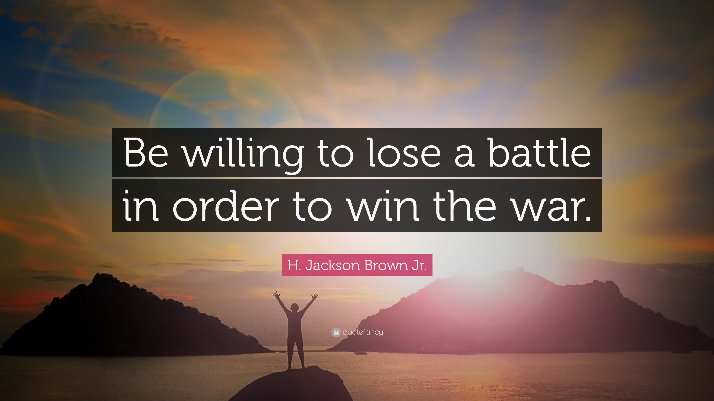

The impulse to win an argument and prove that you are right can be a strong driving force, but it's important not to let it take priority over keeping a good client. 

<!--endintro-->

If the client is unhappy or upset, it's more important to show empathy and demonstrate that you understand your client's point of view, as it is more likely to win you future work.

Make sure you start a reply to an angry client with something like "I understand your frustration, and I think I can stop this happening again". At this point in time, you want to aim for a compromise, where each party meets the other, somewhere in the middle.

### How to understand and rationalize dissenting opinions

When you’re not able to get your point across, and the client is convinced of their own course, it can be frustrating, but there are 2 potential reasons why 2 reasonable people don’t agree on a point:

1. You haven’t explained your point well enough. (i.e. you haven’t given them all the information)
2. You don’t understand the full context for their decision. (i.e. they haven’t given you all the information)

If it’s something you care a lot about then give the client some space and try again later. For example, send a [1 week follow up](/do-you-follow-up-emails-effectively) to yourself to have another discussion to try and explain your point again, this time touching different points. During this 2nd conversation, you might be able to get more information from them to understand their point. 

If after this, you still can’t agree, then go with what the client wants, and send a gently worded [For the Record](/send-a-for-the-record-email-when-you-disagree) email to document your opinion.
