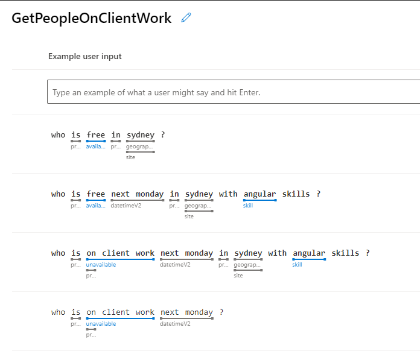
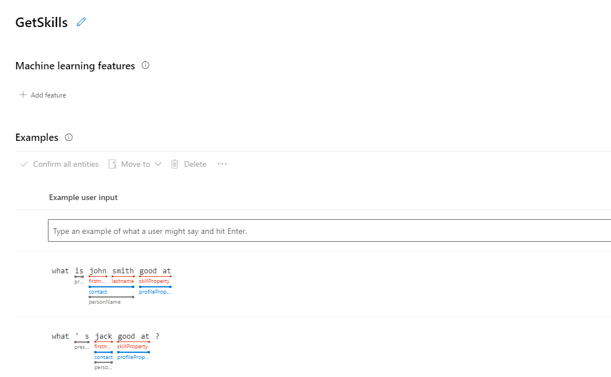
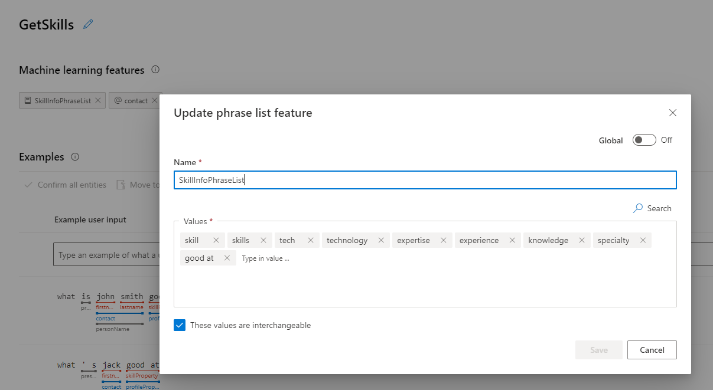
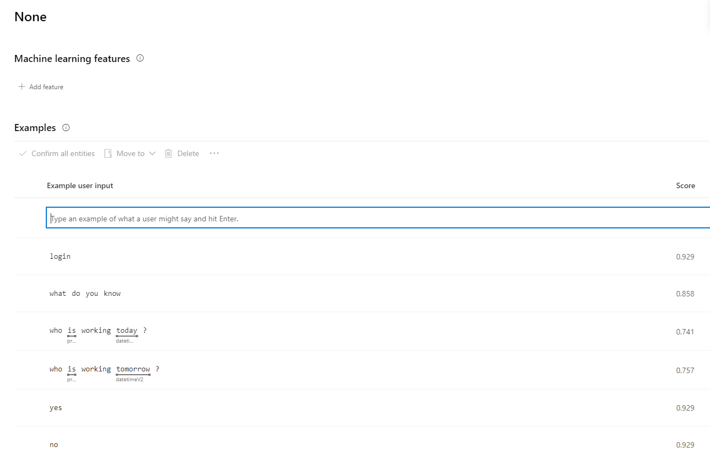

When building a chat bot, it needs some way to understand natural language text to simulate a person and provide a conversational experience for users. If you are using [Microsoft Bot Framework](https://docs.microsoft.com/en-us/azure/bot-service/?view=azure-bot-service-4.0), you can use [LUIS](https://www.luis.ai). LUIS is a natural language processing service and it provides some awesome benefits...

<!--endintro-->

* Built-in support from Microsoft Bot Framework
* Well-trained prebuilt entities (e.g. Person names, date and time, geographic locations)
* A user friendly GUI portal where you can create, test and publish LUIS apps with just a couple of clicks

## Intents and User Utterances
To build a LUIS application, you need to classify different utterances that a user might ask into specific "intents".   

In LUIS, you can achieve that by defining distinct intents and adding example user utterances in each of them.

## Entities
To perform custom logic for a recognize result (e.g. retrieve developers data from database when user asks "Who is working on SophieBot"), the bot needs a variable to extract the subject user was asking about ("SophieBot" in the former case).   

In LUIS, you can achieve that by defining entities in user utterances.

## Features
To improve prediction accuracy, LUIS needs a better understanding on the core concept of the intents (e.g. "What's xxx's skills" is all about quering someone's **skills** whenever the user used "skill", "experience", "technology" or even another format of phrase, so **skill** can be the core concept in this intent).  

In LUIS, you can achieve that by defining features on intents. A feature is often a phrase list but can also be an entity. 

## Best Practise
In order to make LUIS' recognition more precise, the best practise is to:

* **Do** define distinct intents
::: bad

:::

::: good 

:::

* **Do** assign features for intents.
::: bad

:::

::: good 

:::

* **Do** add examples to None intent

::: good 

:::