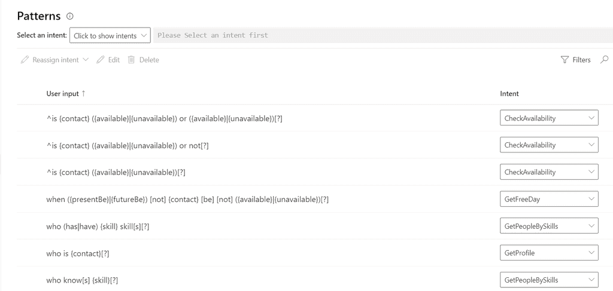

When building a chat bot, it needs some way to understand natural language text to simulate a person and provide a conversational experience for users. If you are using [Microsoft Bot Framework](https://docs.microsoft.com/en-us/azure/bot-service/?view=azure-bot-service-4.0), you can use [LUIS](https://www.luis.ai). LUIS is a natural language processing service and it provides some awesome benefits...

<!--endintro-->

* Built-in support from Microsoft Bot Framework
* Well-trained prebuilt entities (e.g. Person names, date and time, geographic locations)
* A user friendly GUI portal where you can create, test and publish LUIS apps with just a couple of clicks

To build a LUIS application, you need to classify different utterances that a user might ask into specific "intents".

When creating intents, there is a chance you could come across several intents with very similar utterances. In order to make LUIS' recognition more precise, the best practise is to:

* **Do** define distinct intents

::: bad

:::

* Assign patterns for intents that have fixed ways of phrasing.
* Assign features for intents that have similar utterances to other intents.

::: good 

:::

::: good 

:::