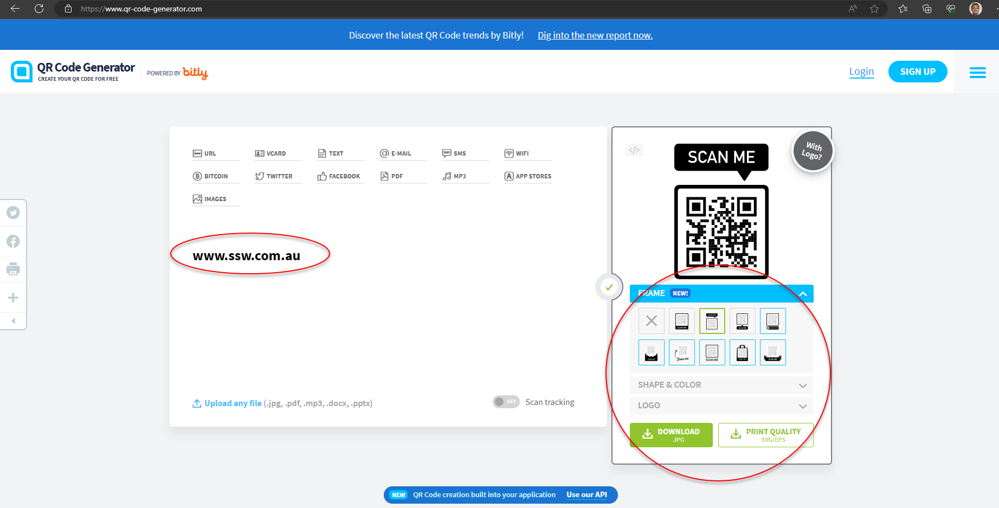

You can create and share the best media, but if people cannot easily interact with your site, the hard work is wasted. Imagine you've set up a great campaign, but to get to your website users must manually type in the URL. This will handicap engagement for even the most exceptional marketing. The last thing you want is for a user's experience to be cumbersome.

<!--endintro-->

QR codes give a smooth transition from offline to online content, which simplifies user interaction. They are effective in [many different contexts](/all-the-things-you-can-use-qr-code-for).

### **Steps to Create a QR Code**

1. **Choose a Generator:** There are many online that have different features. [QR Code Generator](https://www.qr-code-generator.com/) is a simple, free one to use.

2. **Enter your link:** You can link to a URL, text or other data.

3. **Customize it:** Many generators let you modify the design of your QR code. Sometimes you have to pay for extra customization.

4. **Download The QR Code:** Look for the download button (you might have to choose whether you want jpg, png, etc.).

::: greybox
⚠️ Note: You should never have to create an account to download a basic QR code. Many websites will try to fool you into making one. Don't fall for it!
:::

### Tracking QR Code data through Google Analytics (GA)

If you want to track data through Google Analytics, it's very easy.

1. First use the [Google Campaign URL Builder](https://ga-dev-tools.google/campaign-url-builder/) to create your link
2. Use the new link to create your QR code

::: greybox
<https://www.ssw.com.au/?utm_source=newsletter&utm_medium=qr+code&utm_campaign=marketing>
:::

::: good
Figure: Good example - The link you use to make the QR code will have a '?utm_source' ending
:::
