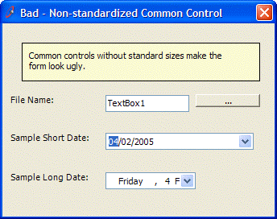
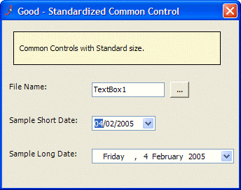
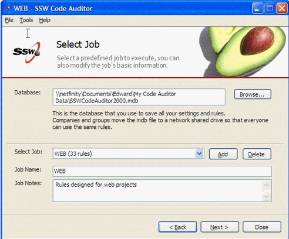
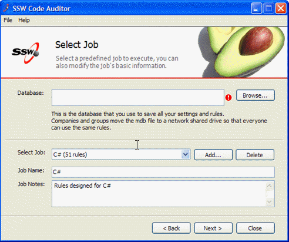

There are a few common controls we always use in our products. For example, DateTime and Ellipsis Button. We need a standard for the width so the controls should be more consistent.
Note: Controls on base forms will be made to be 'protected' rather than 'private', especially so that inherited forms of different sizes don't mess up.

<!--endintro-->

::: bad

:::

::: good

:::

::: bad

:::

::: good

:::

We have a program called [SSW Code Auditor](https://ssw.com.au/ssw/CodeAuditor/Rules.aspx#CommonControl) to check for the following two rules: 
<ul>
<li><b>Rule - C#/VB.NET UI- Button Height and Width - for Standard Button (75 x 23 pixels) &#8211; Level 2: all buttons < 6 characters:</b> Check the standard size (75 X 23 pixels) for buttons with the word length less than or equal to six characters, except the following buttons. 
<li><b>Rule - C#/VB.NET UI- Button Height and Width - for Standard Button (75 x 23 pixels) &#8211; Level 1: the action buttons:</b> Check the standard size (75 X 23 pixels) for the following action buttons.</li><ul> <li>Add</li> <li>Delete</li> <li>Edit </li> <li>OK</li> <li>Close</li> <li>Cancel</li> <li>Save</li> <li>Browse</li> <li>Select</li> <li>Test</li> <li>Next</li> <li>Back</li> <li>Remove</li> <li>Refresh (Exception to the rule as it has 7 letters)</li> </ul> </ul>
